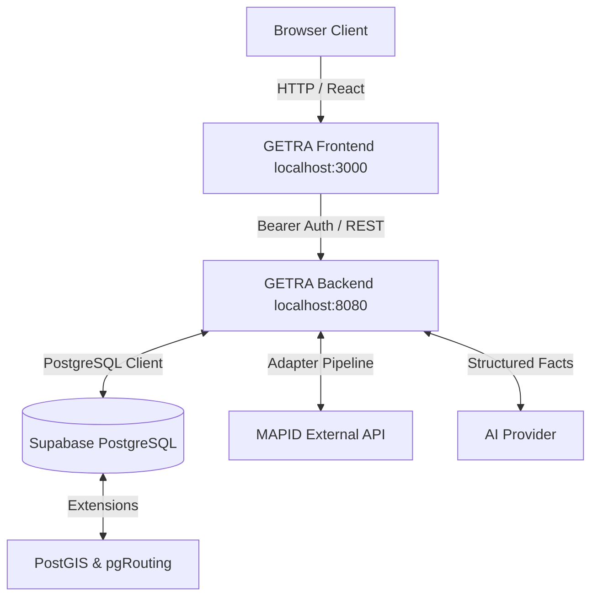
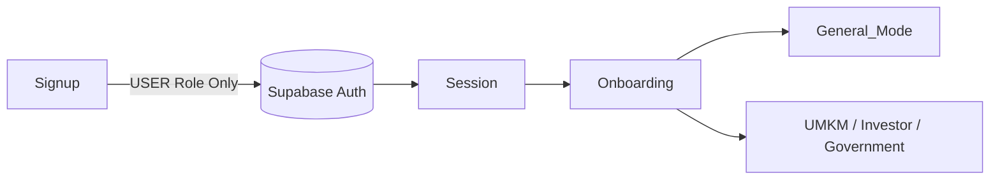

# GETRA Final System Documentation
**Integration Baseline v1.0**

**Snapshot Date**: 2026-08-23
**Snapshot Branch**: `finalmerge`

---

## Table of Contents
1. System Overview
2. Final Architecture & Data Flow
3. Repository Structure & Runtimes
4. Frontend Application
5. Backend Application & API
6. Authentication & User Journey
7. Database, Migrations & RLS
8. External Ingestion & Provenance (MAPID)
9. GIS, Spatial Analysis & Routing
10. Grounded AI Interpretation
11. Security Audit
12. Environment, Testing & Deployment
13. Known Limitations & Technical Debt
14. Developer Handover Summary
15. Final Status

---

## 1. System Overview
GETRA (Geo-Enabled Transit & Retail Analytics) is an advanced web platform designed to analyze the intersection between public transit infrastructure, pedestrian walkability, and retail (UMKM) demand. 

Integration Phase 13 marks the completion of the foundational integration track. The system separates a React-based client (Frontend) from a robust API server (Backend), strictly leveraging PostgreSQL/PostGIS for all spatial logic, and an LLM merely for conversational interpretation.

---

## 2. Final Architecture & Data Flow

### System Architecture


### Data Flow Pipeline
```text
External Provider (MAPID / Survey)
↓
Adapter Layer (Backend)
↓
Raw / Staging Tables
↓
Validation & Technical Deduplication
↓
Canonical Entity (UMKM, Community, etc.)
↓
Backend API Route
↓
Frontend UI / AI Interpretation
```

---

## 3. Repository Structure & Runtimes

The project avoids monolithic coupling.
- `frontend/` (Port 3000): Contains Next.js UI, MapLibre assets, hooks, and API clients.
- `backend/` (Port 8080): Contains Next.js acting exclusively as an API, Vitest suites, spatial services, LLM agents, and Supabase configurations.

Both runtimes boot deterministically.

---

## 4. Frontend Application
- **Routing**: Next.js App Router (`app/`).
- **MapLibre**: Utilizes vector tiles and custom worker assets for rendering the Study Area, Transport nodes, and UMKM markers.
- **Data Fetching**: Centralized `api-client.ts` automatically attaches the active Supabase Session token to outgoing `fetch` requests towards the backend.
- **Stakeholder UX**: Views adapt based on the user's selected mode (General vs UMKM vs Investor), but this is purely presentational context.

---

## 5. Backend Application & API
The backend acts strictly as an API server exposing JSON REST endpoints. 
Key domains:
- `/api/auth/*`: Registration, login, and session validation.
- `/api/spatial/*`: Geometry lookups (bboxes, distance, nearest nodes).
- `/api/routing`: Dijkstra graph walk path computation.
- `/api/ai/ask`: Intent detection and response formulation.
- `/api/v1/*`: Canonical data reads (Study Areas, Transport Networks).

---

## 6. Authentication & User Journey

### Auth Flow

- **Email Confirmation**: *TEMPORARILY DISABLED*. Users proceed directly to onboarding.
- **Roles**: Only `USER` and `ADMIN` exist. Commuter and UMKM_OWNER roles were abolished.
- **Zero-Mode User**: A user selecting zero optional stakeholder modes is valid and defaults to the "General / Komuter" experience.
- **UMKM Ownership**: Selecting the UMKM stakeholder mode does *not* automatically grant ownership or edit rights to a merchant business.

---

## 7. Database, Migrations & RLS
- **Supabase / PostgreSQL**: The definitive source of truth.
- **Migrations**: Generated via `supabase db diff --use-migra`. Never use destructive reset commands on production.
- **RLS**: Strictly enforced. A `USER` can only modify their own profile data. Spatial network data is globally readable but immutable to users.
- **Generated Types**: Frontend and Backend share strong typings generated directly from the remote schema.

---

## 8. External Ingestion & Provenance (MAPID)
If the MAPID external provider credentials are met, the ingestion engine (restricted to `ADMIN`) pulls raw datasets into staging.
- **Deduplication**: Runs idempotently.
- **Provenance**: Final canonical records (`umkm`, `transport_nodes`) explicitly tag their source (`source_provider`, `external_id`).
- **Data Classification**: Current databases contain a `MIXED` state of `REAL` pilot data and `DUMMY` structural geometries necessary for routing proofs.

---

## 9. GIS, Spatial Analysis & Routing
**Principle: GIS COMPUTES. AI INTERPRETS.**
- **PostGIS**: Provides SRID 4326 geometry validation, radial `ST_DWithin` proximity lookups, and bounding box queries.
- **pgRouting**: The `pedestrian_network_ways` graph is compiled into a topology. `/api/routing` snaps origin coordinates to the nearest edge and executes `pgr_dijkstra` to return valid GeoJSON `LineStrings`.
- **Accessibility**: Currently lacks gradient and wheelchair-barrier awareness (tracked as future technical debt).

---

## 10. Grounded AI Interpretation
- **Intent**: The AI detects if the user needs help, routing, or POI lookups.
- **Grounding**: The backend intercepts the intent and executes actual PostGIS queries. The resulting *facts* are injected into the AI prompt.
- **Security**: The AI cannot inject arbitrary SQL and has no access to raw tables.

---

## 11. Security Audit
- **Secrets**: Verified absent from all documentation, git commits, and frontend bundles.
- **Service Role**: `SUPABASE_SERVICE_ROLE_KEY` is completely isolated to backend internal use only.
- **CORS**: `FRONTEND_ALLOWED_ORIGINS` protects the backend from cross-site exploitation.
- **Rate Limiting**: Applied to `/api/auth/login` to deter brute-force and scraping.

---

## 12. Environment, Testing & Deployment
- **Environment**: Names (not values) are documented in `GETRA_Environment_Reference.md`.
- **Testing**: A Vitest suite strictly validates API contracts and spatial errors before every build.
- **Deployment**: Configured for PM2/Docker. Production deployments must manually configure SMTP (if email verification is desired) and inject platform secrets.

---

## 13. Known Limitations & Technical Debt
- **BLOCKING**: *None.* (Integration Phase 12 proved zero critical regressions).
- **NON-BLOCKING**:
  - Email confirmation requires policy decision before public launch.
  - Accessibility routing graph needs specialized survey data.
  - Deployment is ready structurally but requires physical provisioning.

---

## 14. Developer Handover Summary
Future engineers should rely on the `GETRA_Developer_Handover.md` and this document.
The system is built on standard Next.js paradigms with heavy PostgreSQL offloading. Do not casually modify the database schema without proper Supabase local testing.

---

## 15. Final Status
**INTEGRATION TRACK 1–13**: COMPLETE
**NEW FEATURE DEVELOPMENT**: READY
