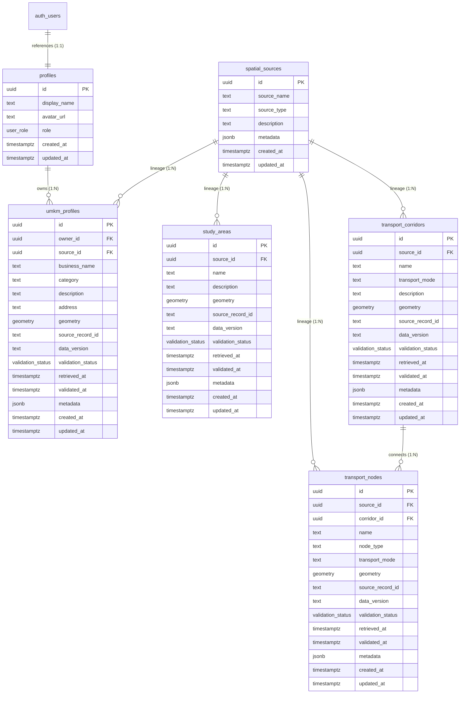
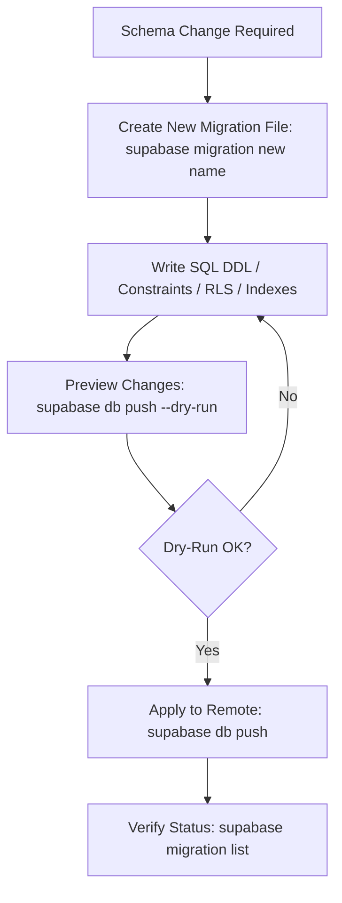

# GETRA Backend Complete Technical Documentation
## Architecture, API Catalog, Database & PostGIS Foundation, Docker Operations, Security & Operational Handover

---

**Project Name:** GETRA (Gerakan Transit Ramah Anak / Transit & Spatial Intelligence Platform)  
**Document Version:** 1.0.0 (Final Backend Baseline)  
**Date:** 2026-08-17 (Asia/Jakarta)  
**Status:** AUDITED & VERIFIED  
**Target Environment:** Node.js 22 LTS / Next.js 16.3.1 Standalone / Supabase PostgreSQL & PostGIS Remote  

---

## TABLE OF CONTENTS

1. [Executive Summary](#1-executive-summary)
2. [GETRA Backend Overview](#2-getra-backend-overview)
3. [Technology Stack](#3-technology-stack)
4. [System Architecture](#4-system-architecture)
5. [Project Folder Structure](#5-project-folder-structure)
6. [Authentication System](#6-authentication-system)
7. [User Profiles & Roles](#7-user-profiles--roles)
8. [Row Level Security (RLS) & Authorization](#8-row-level-security-rls--authorization)
9. [API Architecture & Response Contracts](#9-api-architecture--response-contracts)
10. [Database Architecture & Schema](#10-database-architecture--schema)
11. [PostGIS Spatial Foundation](#11-postgis-spatial-foundation)
12. [Data Model & Entities](#12-data-model--entities)
13. [Repository Layer](#13-repository-layer)
14. [External Data Integration & MAPID Adapter](#14-external-data-integration--mapid-adapter)
15. [Spatial Engine Modules](#15-spatial-engine-modules)
16. [Docker Architecture & Containerization](#16-docker-architecture--containerization)
17. [Public API Security Hardening](#17-public-api-security-hardening)
18. [API Catalog](#18-api-catalog)
19. [API Request & Response Examples](#19-api-request--response-examples)
20. [Authentication & Registration Examples Per Role](#20-authentication--registration-examples-per-role)
21. [Supabase Migration Runbook](#21-supabase-migration-runbook)
22. [Database Seeding Guide](#22-database-seeding-guide)
23. [Database TypeScript Types Generation](#23-database-typescript-types-generation)
24. [Development Mode Running Guide](#24-development-mode-running-guide)
25. [Docker Container Running Guide](#25-docker-container-running-guide)
26. [24/7 Production Operations Guide](#26-247-production-operations-guide)
27. [Backend Logging & Health Monitoring](#27-backend-logging--health-monitoring)
28. [Frontend Integration Guide](#28-frontend-integration-guide)
29. [Environment Variables Reference](#29-environment-variables-reference)
30. [Security Checklist & Compliance](#30-security-checklist--compliance)
31. [Testing & Quality Assurance Guide](#31-testing--quality-assurance-guide)
32. [Troubleshooting & Diagnostics Guide](#32-troubleshooting--diagnostics-guide)
33. [Known Limitations](#33-known-limitations)
34. [Features Waiting for Production Data](#34-features-waiting-for-production-data)
35. [Phase Completion Summary (Phases 0–7 + Extra)](#35-phase-completion-summary-phases-07--extra)
36. [Operational Handover Checklist](#36-operational-handover-checklist)

---

## 1. Executive Summary

GETRA (Gerakan Transit Ramah Anak) Backend is a high-performance, modular geospatial and transit data platform built on **Next.js 16 (App Router)** and **Supabase (PostgreSQL with PostGIS)**. The backend acts as the core transactional, spatial, and integration engine supporting transit node mapping, study area demarcations, corridor routing foundations, UMKM business directory integration, and role-based commuter services.

### Core Capabilities Summary:
* **Architecture:** Layered Clean Architecture (HTTP Handler $\rightarrow$ Security Middleware $\rightarrow$ Zod Validation $\rightarrow$ Service $\rightarrow$ Repository $\rightarrow$ PostGIS).
* **Database & PostGIS:** 6 normalized PostgreSQL tables with strict constraints, EPSG:4326 spatial geometry types (Point, MultiLineString, MultiPolygon), GiST indexing, and server-side RPC functions for bounded bounding-box and proximity queries.
* **Authentication & Authorization:** Stateless Supabase JWT Bearer token authentication with 4 roles (`COMMUTER`, `UMKM`, `COMMUNITY`, `ADMIN`), Row Level Security (RLS) enforcement, and column-level permission boundaries.
* **Security Hardening:** Strict origin CORS allowlist, granular rate limiting, bounded streaming JSON parsing, secure HTTP headers (CSP, HSTS, X-Frame-Options, etc.), request IDs, and non-root Docker execution.
* **Integrations:** Extensible MAPID / External Data Adapter foundation featuring fixture-based testing, dry-run simulation, and data provenance tracking.
* **Operational Readiness:** Fully dockerized multi-stage standalone runtime with automated health checking and 24/7 PM2 process management support.

---

## 2. GETRA Backend Overview

The GETRA backend provides secure, bounded RESTful endpoints for web and mobile frontends. It is designed around the principle of **strict contract safety**: no unverified external dependencies are invoked in production, all queries are bounded to prevent denial-of-service, and sensitive credentials (such as service-role keys or database passwords) are strictly quarantined from public runtime bundles.

### System Verification & Implementation Status:
* **Overall Status:** `FOUNDATION IMPLEMENTED — ACCURACY AUDITED`
* **Real Production Data:** `PENDING PRODUCTION INGESTION`
* **Real MAPID Connection:** `FOUNDATION ONLY — OFFICIAL CONTRACT REQUIRED`
* **Pedestrian Graph Routing:** `FOUNDATION ONLY — PRODUCTION GRAPH REQUIRED`

---

## 3. Technology Stack

The GETRA backend stack is strictly documented from `package.json`, source code, and configuration files:

| Layer / Category | Technology / Library | Version | Purpose in GETRA |
| :--- | :--- | :--- | :--- |
| **Language** | TypeScript | `^6.0.3` | Type-safe backend domain models, DTOs, and schemas |
| **Framework** | Next.js | `^16.3.1` | App Router API Route Handlers and Standalone Server |
| **Runtime Core** | React / React DOM | `^19.2.8` | Core Next.js 16 engine peer dependencies |
| **Server Boundary** | `server-only` | `^0.0.1` | Prevents server modules from leaking into client bundles |
| **Validation** | Zod | `^4.4.3` | Runtime schema validation for requests, configs, and payloads |
| **Database SDK** | `@supabase/supabase-js` | `^2.112.3` | Supabase PostgreSQL client and authentication provider |
| **Database Engine**| PostgreSQL + PostGIS | Remote (Supabase) | Spatial data storage, GiST indexing, and spatial calculations |
| **Container Engine**| Docker & Docker Compose | Node 22-slim | Standalone containerization and reproducible deployment |
| **Process Manager** | PM2 | `^7.0.3` | 24/7 host process monitoring and automatic crash restarts |
| **Testing Engine** | Vitest | `^4.1.10` | Unit, integration, and security test runner |
| **Linter / Quality** | ESLint / eslint-config-next | `^9.39.5` / `^16.3.1` | Static code analysis and style verification |
| **CLI Tooling** | Supabase CLI | `^2.114.0` | Local database management and migration tooling |

---

## 4. System Architecture

GETRA implements a strict, multi-tiered architecture that separates concerns between transport protocol, security guards, input validation, domain business logic, data persistence, and database-level RLS.

### 4.1 Standard Request Flow

```text
[ Incoming HTTP Request from Frontend / Mobile Client ]
                          │
                          ▼
             [ CORS Exact Origin Check ] ── (Unknown Origin: 403 Forbidden)
                          │
                          ▼
            [ Granular Rate Limit Guard ] ── (Limit Exceeded: 429 Too Many Requests)
                          │
                          ▼
         [ Security Headers & Request ID Injection ] (x-request-id generated / traced)
                          │
                          ▼
          [ Authentication / Bearer JWT Guard ] ── (Missing/Invalid: 401 Unauthorized)
                          │
                          ▼
              [ Role Authorization Guard ] ── (Forbidden Role: 403 Forbidden)
                          │
                          ▼
          [ Bounded JSON / Query Zod Validation ] ── (Invalid Payload: 400 Bad Request)
                          │
                          ▼
                 [ Domain Service Layer ]
                          │
                          ▼
               [ Repository Layer (RPC/SQL) ]
                          │
                          ▼
          [ Supabase PostGIS with Row Level Security ]
```

### 4.2 External Provider / MAPID Adapter Pipeline

```text
[ MAPID / External API Source ]
               │
               ▼
      [ External Client ] ── (Timeout, Retries, Bearer/Header Injection)
               │
               ▼
     [ Fixture / Schema Validator ] ── (Zod Contract Verification)
               │
               ▼
     [ Data Normalizer ] ── (Transforms to Standard GeoJSON & WGS84)
               │
               ▼
      [ Domain Mapper ] ── (Maps to GETRA Entity DTOs)
               │
               ▼
 [ External Data Service ] ── (Dry-run mode, Duplicate Check, Lineage Tagging)
               │
               ▼
 [ External Record Repository ] ── (Transactional Batch Persistence & Provenance)
```

### 4.3 Spatial Engine Flow

```text
[ API Spatial Route: /distance, /nearby, /bbox ]
                          │
                          ▼
            [ Coordinate / Bounds Validation ]
                          │
                          ▼
              [ Spatial Service Layer ]
         (Distance, Proximity, BBox, WalkingTime)
                          │
                          ▼
             [ Spatial Repository Layer ]
                          │
                          ▼
        [ PostGIS Database Spatial Functions ]
  (ST_DWithin, ST_Intersects, ST_Distance on EPSG:4326)
```

---

## 5. Project Folder Structure

The repository structure reflects Clean Architecture with strict separation of routes, schemas, domain modules, repositories, and migration files:

```text
getra-backend/
├── app/                                 # Next.js App Router root
│   └── api/                             # API route handlers
│       ├── auth/                        # Authentication endpoints
│       │   ├── login/route.ts           # POST /api/auth/login, OPTIONS
│       │   ├── logout/route.ts          # POST /api/auth/logout, OPTIONS
│       │   ├── me/route.ts              # GET /api/auth/me, OPTIONS
│       │   └── register/route.ts        # POST /api/auth/register, OPTIONS
│       ├── health/                      # Health & readiness probe
│       │   └── route.ts                 # GET /api/health, OPTIONS
│       ├── profile/                     # Profile management
│       │   └── route.ts                 # GET, PATCH /api/profile, OPTIONS
│       ├── spatial/                     # Geospatial endpoints
│       │   ├── bbox/route.ts            # GET /api/spatial/bbox, OPTIONS
│       │   ├── distance/route.ts        # POST /api/spatial/distance, OPTIONS
│       │   └── nearby/route.ts          # GET /api/spatial/nearby, OPTIONS
│       └── v1/                          # Versioned endpoint placeholder (.gitkeep)
├── src/                                 # Core backend source code
│   ├── config/                          # Application bootstrap & runtime config
│   ├── integrations/                    # External data integrations & adapters
│   │   ├── core/                        # Common external provider contracts & errors
│   │   └── mapid/                       # MAPID adapter, client, mapper, normalizer
│   ├── lib/                             # Shared utility libraries & security helpers
│   │   ├── api-security/                # CORS, security headers, endpoint policies
│   │   ├── env/                         # Type-safe environment validation
│   │   ├── errors/                      # ApplicationError hierarchy & error codes
│   │   ├── http/                        # Timeout fetch & abort controller helpers
│   │   ├── logger/                      # Sanitized structured logging helpers
│   │   ├── spatial/                     # Spatial parsing, GeoJSON mappers & SRID helpers
│   │   ├── supabase/                    # Server & request-scoped Supabase client factories
│   │   ├── api-logger.ts                # withApiLogger request wrapper
│   │   ├── api-response.ts              # Standard JSON envelope creators
│   │   ├── auth.ts                      # Authentication & role guard utilities
│   │   ├── pagination.ts                # List pagination helpers
│   │   ├── query-parser.ts              # Query parameter parsers
│   │   ├── rate-limit.ts                # In-memory fixed-window rate limiter
│   │   ├── request-body.ts              # Bounded stream JSON body reader
│   │   ├── request-id.ts                # UUID request tracer
│   │   └── validation.ts                # Zod request body & query validators
│   ├── mappers/                         # Domain, geometry, and profile data mappers
│   ├── modules/                         # Specialized business logic domain modules
│   │   ├── spatial/                     # PostGIS spatial calculation & query services
│   │   └── spatial-import/              # Spatial import contracts & normalization
│   ├── repositories/                    # Data access layer interfacing with Supabase
│   ├── schemas/                         # Central Zod validation schemas
│   ├── services/                        # Domain service layer
│   └── types/                           # TypeScript interfaces and entity types
├── supabase/                            # Supabase database configuration
│   ├── migrations/                      # PostgreSQL migrations (source of truth)
│   ├── tests/database/                  # pgTAP database tests
│   ├── config.toml                      # Local Supabase CLI configuration
│   └── seed.sql                         # Synthetic DEV/TEST seed fixture data
├── tests/                               # Comprehensive Vitest test suite
│   ├── fixtures/                        # Synthetic GeoJSON and MAPID test fixtures
│   ├── integration/                     # API route & security integration tests
│   └── unit/                            # Unit tests for models, services & repositories
├── deployment/                          # Deployment environment guidelines
├── docs/                                # Technical documentation & change logs
│   ├── changes/                         # Phase change logs (Phase 4, 6, 7, Extra, Final)
│   ├── database/                        # Database architecture documentation
│   └── final/                           # Complete master technical documentation & PDF
├── Dockerfile                           # 3-stage standalone Node 22 production Dockerfile
├── docker-compose.yml                   # Base Docker Compose specification
├── docker-compose.prod.yml              # Production Docker Compose security overrides
├── ecosystem.config.cjs                 # PM2 process manager configuration
├── next.config.ts                       # Next.js configuration (standalone output)
├── tsconfig.json                        # TypeScript compiler configuration
└── package.json                         # Project dependencies and script definitions
```

---

## 6. Authentication System

GETRA utilizes **Supabase Auth** as the underlying authentication provider, utilizing JSON Web Tokens (JWT) transmitted via HTTP `Authorization: Bearer <token>` headers.

### 6.1 Authentication Lifecycle

1. **Registration (`POST /api/auth/register`):**
   * Creates a new user in `auth.users`.
   * Trigger `public.handle_new_user()` automatically creates a corresponding record in `public.profiles`.
   * **Security Rule:** Public registration strictly permits `COMMUTER`, `UMKM`, or `COMMUNITY` roles. Requesting `ADMIN` triggers an immediate `403 Forbidden` error.
2. **Login (`POST /api/auth/login`):**
   * Authenticates user credentials via `supabase.auth.signInWithPassword()`.
   * Returns `access_token`, user identifier, email, and associated profile summary (`display_name`, `role`).
3. **Session Verification (`GET /api/auth/me`):**
   * Validates bearer token against Supabase Auth.
   * Fetches user profile using a request-scoped Supabase client subject to RLS.
4. **Logout (`POST /api/auth/logout`):**
   * Acknowledges stateless logout (`token_disposition: "client_discard_required"`).
   * Frontend client must immediately purge the token from local storage / memory.

### 6.2 Bearer Token Extraction & Validation

Bearer tokens are bounded to a maximum of 8,192 characters and validated against the format `^Bearer ([^\s]+)$`. Unauthenticated or malformed requests are rejected with a standardized `UNAUTHORIZED` error (HTTP 401).

---

## 7. User Profiles & Roles

GETRA defines four explicit user roles via the PostgreSQL enum type `public.user_role`:

| Role Enum | Description | Intended Platform Capabilities |
| :--- | :--- | :--- |
| `COMMUTER` | General public transit user | Public transit search, nearby stops, bookmarks, walking calculations |
| `UMKM` | Verified merchant / business owner | Manage owned UMKM profile, location, business information |
| `COMMUNITY` | Community leader / local group | View community transit initiatives and report transit observations |
| `ADMIN` | System administrator | Manage all spatial sources, reference nodes, corridors, and all profiles |

### 7.1 Role Authorization Matrix

| Endpoint | Public | COMMUTER | UMKM | COMMUNITY | ADMIN |
| :--- | :---: | :---: | :---: | :---: | :---: |
| `GET /api/health` | $\checkmark$ | $\checkmark$ | $\checkmark$ | $\checkmark$ | $\checkmark$ |
| `POST /api/auth/login` | $\checkmark$ | $\checkmark$ | $\checkmark$ | $\checkmark$ | $\checkmark$ |
| `POST /api/auth/register` | $\checkmark$ | $\checkmark$ | $\checkmark$ | $\checkmark$ | $\times$ (Blocked) |
| `POST /api/auth/logout` | $\times$ | $\checkmark$ | $\checkmark$ | $\checkmark$ | $\checkmark$ |
| `GET /api/auth/me` | $\times$ | $\checkmark$ | $\checkmark$ | $\checkmark$ | $\checkmark$ |
| `GET /api/profile` | $\times$ | $\checkmark$ | $\checkmark$ | $\checkmark$ | $\checkmark$ |
| `PATCH /api/profile` | $\times$ | $\checkmark$ | $\checkmark$ | $\checkmark$ | $\checkmark$ |
| `POST /api/spatial/distance` | $\times$ | $\checkmark$ | $\checkmark$ | $\checkmark$ | $\checkmark$ |
| `GET /api/spatial/nearby` | $\times$ | $\checkmark$ | $\checkmark$ | $\checkmark$ | $\checkmark$ |
| `GET /api/spatial/bbox` | $\times$ | $\checkmark$ | $\checkmark$ | $\checkmark$ | $\checkmark$ |

### 7.2 Administrator Provisioning Security Policy

> [!CAUTION]
> **Admin Role Protection:** The `ADMIN` role cannot be provisioned through public registration. The trigger `public.handle_new_user()` will raise exception `ROLE_NOT_ALLOWED` if `role = 'ADMIN'` is provided in metadata. Admin privileges must be assigned manually by a database administrator via direct SQL or a secure administrative migration script.

---

## 8. Row Level Security (RLS) & Authorization

Row Level Security is enabled on every table in the database. Client queries are executed with the user's JWT, ensuring that database-level authorization is enforced by PostgreSQL even if application-level checks fail.

### 8.1 Complete RLS Policy Table

| Table Name | RLS Enabled | Allowed Roles | Operation | Policy Definition / Owner Rule |
| :--- | :---: | :--- | :---: | :--- |
| `public.profiles` | **YES** | `authenticated` | `SELECT` | `auth.uid() = id` (Read own profile) |
| `public.profiles` | **YES** | `authenticated` | `UPDATE` | `auth.uid() = id` (Update own profile) |
| `public.profiles` | **YES** | `authenticated` | `SELECT` | `private.is_admin()` (Admins read all) |
| `public.profiles` | **YES** | `authenticated` | `UPDATE` | `private.is_admin()` (Admins update all) |
| `public.spatial_sources` | **YES** | `authenticated` | `SELECT` | `true` (All authenticated can read) |
| `public.spatial_sources` | **YES** | `authenticated` | `ALL` | `private.is_admin()` (Admins manage) |
| `public.study_areas` | **YES** | `authenticated` | `SELECT` | `true` (All authenticated can read) |
| `public.study_areas` | **YES** | `authenticated` | `ALL` | `private.is_admin()` (Admins manage) |
| `public.transport_corridors`| **YES** | `authenticated` | `SELECT` | `true` (All authenticated can read) |
| `public.transport_corridors`| **YES** | `authenticated` | `ALL` | `private.is_admin()` (Admins manage) |
| `public.transport_nodes` | **YES** | `authenticated` | `SELECT` | `true` (All authenticated can read) |
| `public.transport_nodes` | **YES** | `authenticated` | `ALL` | `private.is_admin()` (Admins manage) |
| `public.umkm_profiles` | **YES** | `authenticated` | `SELECT` | `owner_id = auth.uid()` (Owner read) |
| `public.umkm_profiles` | **YES** | `authenticated` | `INSERT` | `owner_id = auth.uid()` (Owner create) |
| `public.umkm_profiles` | **YES** | `authenticated` | `UPDATE` | `owner_id = auth.uid()` (Owner update) |
| `public.umkm_profiles` | **YES** | `authenticated` | `ALL` | `private.is_admin()` (Admins manage all) |

### 8.2 Column-Level Grants & Privilege Hardening

To prevent privilege escalation, column-level permission restrictions are enforced in PostgreSQL:
* **`profiles` Table:** Authenticated users only have `UPDATE` privileges on `(display_name, avatar_url)`. Role assignment cannot be modified by user updates.
* **`umkm_profiles` Table:** Authenticated users only have `INSERT` privileges on `(owner_id, business_name, category, description, address, geometry)`. System provenance columns (`source_id`, `source_record_id`, `data_version`, `validation_status`, `retrieved_at`, `validated_at`, `metadata`) cannot be forged on insert.
* **Trigger `private.enforce_umkm_trusted_fields_update()`:** Blocks non-admin users from altering provenance and ownership metadata during updates.

---

## 9. API Architecture & Response Contracts

Every API response from GETRA follows a strict, predictable JSON envelope format.

### 9.1 Standard Success Envelope (HTTP 200 / 201)

```json
{
  "success": true,
  "data": { ... },
  "request_id": "4d983e20-7ad1-49b8-bc88-34827fb70588"
}
```

### 9.2 Standard Paginated List Envelope (HTTP 200)

```json
{
  "success": true,
  "data": [ ... ],
  "meta": {
    "page": 1,
    "limit": 20,
    "total": 100,
    "total_pages": 5
  },
  "request_id": "4d983e20-7ad1-49b8-bc88-34827fb70588"
}
```

### 9.3 Standard Error Envelope (HTTP 4xx / 5xx)

```json
{
  "success": false,
  "error": {
    "code": "VALIDATION_ERROR",
    "message": "Request validation failed",
    "retryable": false
  },
  "request_id": "4d983e20-7ad1-49b8-bc88-34827fb70588"
}
```

### 9.4 Global Response Headers
All API responses automatically include:
* `x-request-id`: Tracing identifier for telemetry and error tracking.
* `Cache-Control: no-store`: Prevents caching of authenticated and dynamic spatial responses.
* `Retry-After`: Included on HTTP 429 (`RATE_LIMIT_EXCEEDED`) with wait duration in seconds.

---

## 10. Database Architecture & Schema

The GETRA database schema consists of 6 tables created and managed via versioned Supabase migrations.



### 10.1 Table Specifications

#### 1. `public.profiles`
* **Purpose:** Stores user profile information and role assignments linked directly to Supabase Auth.
* **Primary Key:** `id` (`uuid`, references `auth.users(id) ON DELETE CASCADE`).
* **Columns:** `display_name` (text), `avatar_url` (text nullable), `role` (`user_role` NOT NULL DEFAULT `'COMMUTER'`), `created_at` (timestamptz), `updated_at` (timestamptz).
* **Indexes:** PK index on `id`.

#### 2. `public.spatial_sources`
* **Purpose:** Lineage catalog for all spatial layers (e.g. MAPID, field surveys, manual entries).
* **Primary Key:** `id` (`uuid` DEFAULT `gen_random_uuid()`).
* **Columns:** `source_name` (text NOT NULL), `source_type` (text NOT NULL: `'external'`, `'survey'`, `'manual'`, `'imported'`, `'system'`), `description` (text nullable), `metadata` (jsonb NOT NULL DEFAULT `'{}'`), `created_at` (timestamptz), `updated_at` (timestamptz).
* **Indexes:** `idx_spatial_sources_type` (B-tree on `source_type`).

#### 3. `public.study_areas`
* **Purpose:** Boundary polygons representing regional study and transit planning zones.
* **Primary Key:** `id` (`uuid` DEFAULT `gen_random_uuid()`).
* **Geometry:** `geometry(MultiPolygon, 4326)` NOT NULL with `is_valid_wgs84_geometry` check.
* **Lineage & Validation:** `source_id` (FK $\rightarrow$ `spatial_sources.id`), `source_record_id` (text), `data_version` (text), `validation_status` (`validation_status` enum: `'PENDING'`, `'VALIDATED'`, `'REJECTED'`, `'ARCHIVED'`), `retrieved_at`, `validated_at`, `metadata`.
* **Indexes:** `idx_study_areas_geometry_gist` (GiST), `idx_study_areas_source_id` (B-tree), `idx_study_areas_source_record_unique` (Unique B-tree on `(source_id, source_record_id)`).

#### 4. `public.transport_corridors`
* **Purpose:** Linear route geometries representing public transit lines, corridors, and pathways.
* **Primary Key:** `id` (`uuid` DEFAULT `gen_random_uuid()`).
* **Geometry:** `geometry(MultiLineString, 4326)` NOT NULL with `is_valid_wgs84_geometry` check.
* **Columns:** `name` (text NOT NULL), `transport_mode` (text NOT NULL), `description` (text nullable), lineage columns.
* **Indexes:** `idx_transport_corridors_geometry_gist` (GiST), `idx_transport_corridors_source_id` (B-tree), `idx_transport_corridors_mode` (B-tree), `idx_transport_corridors_source_record_unique` (Unique B-tree on `(source_id, source_record_id)`).

#### 5. `public.transport_nodes`
* **Purpose:** Point locations for bus stops, train stations, bike shares, and transit access points.
* **Primary Key:** `id` (`uuid` DEFAULT `gen_random_uuid()`).
* **Geometry:** `geometry(Point, 4326)` NOT NULL with `is_valid_wgs84_geometry` check.
* **Columns:** `name` (text NOT NULL), `node_type` (text NOT NULL), `transport_mode` (text NOT NULL), `corridor_id` (FK $\rightarrow$ `transport_corridors.id`), lineage columns.
* **Indexes:** `idx_transport_nodes_geometry_gist` (GiST on geometry), `idx_transport_nodes_geometry_geography_gist` (GiST on `(geometry::geography)`), `idx_transport_nodes_source_id` (B-tree), `idx_transport_nodes_corridor_id` (B-tree), `idx_transport_nodes_mode_type` (B-tree), `idx_transport_nodes_source_record_unique` (Unique B-tree on `(source_id, source_record_id)`).

#### 6. `public.umkm_profiles`
* **Purpose:** Registered micro, small, and medium enterprise locations and business directories.
* **Primary Key:** `id` (`uuid` DEFAULT `gen_random_uuid()`).
* **Foreign Keys:** `owner_id` (FK $\rightarrow$ `profiles.id` ON DELETE RESTRICT), `source_id` (FK $\rightarrow$ `spatial_sources.id` ON DELETE SET NULL).
* **Geometry:** `geometry(Point, 4326)` NOT NULL with `is_valid_wgs84_geometry` check.
* **Columns:** `business_name` (text NOT NULL), `category` (text NOT NULL), `description` (text nullable), `address` (text nullable), lineage columns.
* **Indexes:** `idx_umkm_profiles_geometry_gist` (GiST on geometry), `idx_umkm_profiles_geometry_geography_gist` (GiST on `(geometry::geography)`), `idx_umkm_profiles_owner_id` (B-tree), `idx_umkm_profiles_source_id` (B-tree), `idx_umkm_profiles_category` (B-tree), `idx_umkm_profiles_source_record_unique` (Unique B-tree on `(source_id, source_record_id)`).

---

## 11. PostGIS Foundation

### 11.1 Spatial Reference & Standards
* **Canonical SRID:** `EPSG:4326` (WGS 84 coordinate system).
* **Coordinates Format:** Standard GeoJSON coordinate order `[longitude, latitude]` for geometry objects, and named `{ longitude, latitude }` objects for API request bodies.
* **Coordinate Bounds Enforced:** Longitude $[-180.0, 180.0]$, Latitude $[-90.0, 90.0]$.

### 11.2 Database Functions & Stored Procedures (RPC)
1. `public.is_valid_wgs84_geometry(input_geometry geometry, allowed_types text[])`: Validates SRID 4326, non-empty status, geometric validity (`ST_IsValid`), allowed typemod, and WGS84 bounding limits.
2. `public.make_wgs84_bbox(min_lng, min_lat, max_lng, max_lat)`: Creates an `ST_MakeEnvelope` polygon with EPSG:4326 after validating coordinate ordering and bounding ranges.
3. `public.wgs84_distance_meters(origin, destination)`: Calculates geodetic surface distance in meters using PostGIS `geography` type casting.
4. `public.find_transport_nodes_near(origin geometry, radius_meters float8)`: Proximity search using `ST_DWithin(geometry::geography, ...)` ordered by distance.
5. `public.find_umkm_profiles_near(origin geometry, radius_meters float8)`: Proximity search for UMKM locations using `ST_DWithin` and geography GiST indexing.
6. `public.find_study_areas_within_bbox(min_lng, min_lat, max_lng, max_lat)`: Bounding box intersection using `&&` operator and `ST_Intersects`.
7. `public.find_transport_corridors_within_bbox(...)`: Bounding box query for transit lines.
8. `public.find_transport_nodes_within_bbox(...)`: Bounding box query for transit stations/nodes.
9. `public.find_umkm_profiles_within_bbox(...)`: Bounding box query for UMKM businesses.
10. `public.getra_database_health()`: Lightweight RPC returning `'connected'` to verify database reachability.

> [!NOTE]
> **pgRouting Status:** `NOT IMPLEMENTED / NOT VERIFIED`. pgRouting is not installed or enabled in the current database migrations. Shortest-path routing over pedestrian graphs remains a foundation contract pending graph data ingestion.

---

## 12. Data Model & Entities

GETRA core entity models are defined in `src/types/entity.ts` and `src/types/domain.ts`:

* **`BaseEntity`:** Base interface containing `id`, `created_at`, and `updated_at`.
* **`ProvenanceEntity`:** Extends `BaseEntity` with `source_id`, `source_record_id`, `data_version`, `validation_status`, `retrieved_at`, `validated_at`, and `metadata`.
* **`StudyArea`:** Represents polygon study zones.
* **`TransportCorridor`:** Represents transit lines with `transport_mode` (`bus`, `rail`, `angkot`, `pedestrian`, etc.).
* **`TransportNode`:** Represents transit stops with `node_type` (`station`, `stop`, `terminal`) and `transport_mode`.
* **`UmkmProfile`:** Represents local merchant points with `owner_id`, `business_name`, and `category`.

---

## 13. Repository Layer

The repository layer abstracts data access, utilizing the Supabase JavaScript Client with parameterization and strict schema mapping:

| Repository Class | Location | Primary Responsibilities |
| :--- | :--- | :--- |
| `ProfileRepository` | `src/repositories/profile.repository.ts` | Profile retrieval and update via RLS |
| `StudyAreaRepository` | `src/repositories/study-area.repository.ts` | Study area querying and bounding box search |
| `TransportCorridorRepository` | `src/repositories/transport-corridor.repository.ts` | Corridor data access and bbox queries |
| `TransportNodeRepository` | `src/repositories/transport-node.repository.ts` | Node queries, proximity search, bbox search |
| `UmkmProfileRepository` | `src/repositories/umkm-profile.repository.ts` | Merchant profile management and spatial search |
| `SpatialSourceRepository` | `src/repositories/spatial-source.repository.ts` | Provenance source registry management |
| `ExternalRecordRepository`| `src/repositories/external-record.repository.ts` | Composition facade for external data persistence |
| `SupabaseHealthRepository`| `src/repositories/supabase-health.repository.ts` | Database connection probe (`getra_database_health`) |
| `SpatialRepository` | `src/modules/spatial/spatial.repository.ts` | Direct PostGIS RPC execution for distance/bbox/nearby |

---

## 14. External Data Integration / MAPID Adapter

The external data integration module (`src/integrations/mapid/`) provides a clean pipeline for ingesting external GIS datasets without coupling GETRA core models to third-party proprietary schemas.

### 14.1 Status & Contract Verification
* **Integration Status:** `FOUNDATION IMPLEMENTED — OFFICIAL CONTRACT REQUIRED`
* **Real MAPID Connection:** `NOT IMPLEMENTED (NO PRODUCTION INGESTION)`
* **Design Pattern:** Inversion of Control with mockable HTTP transport, schema validation, and dry-run execution.

### 14.2 Adapter Pipeline Components
1. **`MapidClient` (`src/integrations/mapid/mapid.client.ts`):** HTTP client with timeout management (`AbortSignal.timeout`), retry logic, and credential masking.
2. **`MapidSchema` (`src/integrations/mapid/mapid.schema.ts`):** Zod validation schemas for incoming external payload verification.
3. **`MapidNormalizer` (`src/integrations/mapid/mapid.normalizer.ts`):** Transforms external attributes into standard WGS84 GeoJSON structures.
4. **`MapidMapper` (`src/integrations/mapid/mapid.mapper.ts`):** Maps normalized data into repository-ready transport node entity inputs.
5. **`ExternalDataService` (`src/services/external-data/external-data.service.ts`):** Orchestrates dry-run ingestion, duplicate detection, and provenance tracking.

---

## 15. Spatial Engine

The spatial engine (`src/modules/spatial/`) delivers core geospatial services backed by PostGIS:

* **`DistanceService`:** Computes accurate geodesic distance between two points in meters using PostGIS `ST_Distance(geometry::geography, destination::geography)`.
* **`ProximityService`:** Performs bounded nearby searches (`ST_DWithin`) around a reference point with configurable radius (default max 50,000m).
* **`BBoxService`:** Queries features intersecting a bounding box (`[west, south, east, north]`) with maximum span limits (default 10 degrees).
* **`WalkingTimeService`:** Estimates pedestrian travel duration based on geodesic distance and configurable walking speed (default 1.4 m/s).
* **`ServiceAreaService`:** Status: `FOUNDATION ONLY — PRODUCTION DATA REQUIRED` (Fails closed with `SPATIAL_NETWORK_NOT_READY`).
* **`RoutingService` / `UnavailableRoutingEngine`:** Status: `NOT IMPLEMENTED` (Fails closed with `ROUTING_GRAPH_NOT_AVAILABLE`).

---

## 16. Docker Architecture

GETRA is containerized as a self-contained Next.js Standalone application.

### 16.1 Multi-Stage Dockerfile Lifecycle
* **Stage 1 (`deps`):** Base `node:22-bookworm-slim`. Runs `npm ci` for deterministic dependencies.
* **Stage 2 (`builder`):** Compiles application via `npm run build`, generating `.next/standalone` and `.next/static`.
* **Stage 3 (`runner`):** Minimal production image. Copies standalone bundle, sets non-root user `node` (`USER node`), exposes port `3000`, and executes `node server.js`.

### 16.2 Container Healthcheck Specification
The container includes a native healthcheck probe:
```bash
HEALTHCHECK --interval=30s --timeout=5s --start-period=30s --retries=3 \
  CMD ["node", "-e", "fetch('http://127.0.0.1:3000/api/health',{signal:AbortSignal.timeout(4000)}).then(response=>{if(!response.ok)process.exit(1)}).catch(()=>process.exit(1))"]
```

---

## 17. Public API Security

GETRA implements comprehensive multi-layer security controls:

### 17.1 Security Controls Summary
1. **CORS Allowlist:** Strict origin matching against `FRONTEND_ALLOWED_ORIGINS`. Wildcards (`*`), `null`, and malformed origins are rejected with `403 Forbidden`. Preflight `OPTIONS` handlers exist on every route.
2. **Rate Limiting:** In-memory fixed-window limiter per user/client IP:
   * **Auth Profile (`auth:login`, `auth:register`):** 5 requests / 60,000 ms.
   * **API Profile (`/api/auth/me`, `/api/profile`):** 60 requests / 60,000 ms.
   * **Mutation Profile (`/api/auth/logout`, `PATCH /api/profile`):** 20 requests / 60,000 ms.
   * **Spatial Profile (`/api/spatial/*`):** 30 requests / 60,000 ms.
3. **Bounded Request Body Reader:** Enforces strict byte caps on incoming JSON streams:
   * Global Default: 65,536 bytes (64 KB).
   * Auth Endpoints: 8,192 bytes (8 KB).
   * Profile & Spatial Endpoints: 4,096 bytes (4 KB).
4. **Security Headers:** Enforces `Content-Security-Policy: default-src 'none'`, `X-Frame-Options: DENY`, `X-Content-Type-Options: nosniff`, `Referrer-Policy: no-referrer`, `Permissions-Policy: camera=(), microphone=(), geolocation=()`, and production HSTS.
5. **No Service-Role Leakage:** Server routes strictly utilize publishable / user JWT client instances. No public API uses `SUPABASE_SERVICE_ROLE_KEY`.

---

## 18. API Catalog

The complete catalog of all 10 verified API endpoints available in GETRA:

| # | Method | Endpoint Path | Classification | Auth Required | Rate Limit Profile | Purpose & Description |
| :---: | :---: | :--- | :---: | :---: | :---: | :--- |
| 1 | `GET` | `/api/health` | `PUBLIC` | None | None | Application readiness & Supabase connectivity probe |
| 2 | `POST` | `/api/auth/login` | `PUBLIC` | None | `auth` (5/min) | Authenticate user via email/password, return access token |
| 3 | `POST` | `/api/auth/register` | `PUBLIC` | None | `auth` (5/min) | Register new non-admin commuter, UMKM, or community user |
| 4 | `POST` | `/api/auth/logout` | `AUTHENTICATED`| Bearer JWT | `mutation` (20/min) | Acknowledge stateless client session termination |
| 5 | `GET` | `/api/auth/me` | `AUTHENTICATED`| Bearer JWT | `api` (60/min) | Get current authenticated user details and profile |
| 6 | `GET` | `/api/profile` | `AUTHENTICATED`| Bearer JWT | `api` (60/min) | Retrieve full user profile of the caller |
| 7 | `PATCH`| `/api/profile` | `AUTHENTICATED`| Bearer JWT | `mutation` (20/min) | Update user profile (`display_name`, `avatar_url`) |
| 8 | `POST` | `/api/spatial/distance` | `AUTHENTICATED`| Bearer JWT | `spatial` (30/min) | Compute geodesic distance in meters between two points |
| 9 | `GET` | `/api/spatial/nearby` | `AUTHENTICATED`| Bearer JWT | `spatial` (30/min) | Find nearby transport nodes or UMKM within radius |
| 10| `GET` | `/api/spatial/bbox` | `AUTHENTICATED`| Bearer JWT | `spatial` (30/min) | Query spatial features within a bounding box |

---

## 19. API Request & Response Examples

### 19.1 Health Check (`GET /api/health`)

#### Request:
```http
GET /api/health HTTP/1.1
Host: localhost:3000
x-request-id: 11111111-2222-3333-4444-555555555555
```

#### Success Response (HTTP 200 OK):
```json
{
  "success": true,
  "data": {
    "service": "getra-api",
    "status": "ok",
    "database": "connected"
  },
  "request_id": "11111111-2222-3333-4444-555555555555"
}
```

#### Error Response — Database Down (HTTP 503 Service Unavailable):
```json
{
  "success": false,
  "error": {
    "code": "DATABASE_UNAVAILABLE",
    "message": "Database connection failed",
    "retryable": true
  },
  "request_id": "11111111-2222-3333-4444-555555555555"
}
```

---

### 19.2 User Login (`POST /api/auth/login`)

#### Request:
```http
POST /api/auth/login HTTP/1.1
Host: localhost:3000
Content-Type: application/json

{
  "email": "commuter.test@example.com",
  "password": "ExamplePassword123!"
}
```

#### Success Response (HTTP 200 OK):
```json
{
  "success": true,
  "data": {
    "session": {
      "access_token": "eyJhbGciOiJIUzI1NiIsInR5cCI6IkpXVCJ9.EXAMPLE_TOKEN_PAYLOAD"
    },
    "user": {
      "id": "e8d0e512-1823-455b-8025-a1312384a601",
      "email": "commuter.test@example.com"
    },
    "profile": {
      "display_name": "Budi Commuter",
      "role": "COMMUTER"
    }
  },
  "request_id": "4d983e20-7ad1-49b8-bc88-34827fb70588"
}
```

#### Error Response — Invalid Credentials (HTTP 401 Unauthorized):
```json
{
  "success": false,
  "error": {
    "code": "UNAUTHORIZED",
    "message": "Invalid email or password.",
    "retryable": false
  },
  "request_id": "4d983e20-7ad1-49b8-bc88-34827fb70588"
}
```

---

### 19.3 User Registration (`POST /api/auth/register`)

#### Request (Commuter):
```http
POST /api/auth/register HTTP/1.1
Host: localhost:3000
Content-Type: application/json

{
  "email": "commuter.new@example.com",
  "password": "ExamplePassword123!",
  "display_name": "Budi Commuter",
  "role": "COMMUTER"
}
```

#### Success Response (HTTP 200 OK):
```json
{
  "success": true,
  "data": {
    "user": {
      "id": "e8d0e512-1823-455b-8025-a1312384a601",
      "email": "commuter.new@example.com"
    },
    "profile": {
      "display_name": "Budi Commuter",
      "role": "COMMUTER"
    }
  },
  "request_id": "4d983e20-7ad1-49b8-bc88-34827fb70588"
}
```

#### Error Response — Admin Role Attempt (HTTP 403 Forbidden):
```json
{
  "success": false,
  "error": {
    "code": "FORBIDDEN",
    "message": "Role ADMIN tidak dapat dibuat melalui public registration.",
    "retryable": false
  },
  "request_id": "4d983e20-7ad1-49b8-bc88-34827fb70588"
}
```

---

### 19.4 Spatial Distance Calculation (`POST /api/spatial/distance`)

#### Request:
```http
POST /api/spatial/distance HTTP/1.1
Host: localhost:3000
Authorization: Bearer <VALID_JWT_TOKEN>
Content-Type: application/json

{
  "origin": {
    "longitude": 107.60981,
    "latitude": -6.914744
  },
  "destination": {
    "longitude": 107.61861,
    "latitude": -6.90389
  }
}
```

#### Success Response (HTTP 200 OK):
```json
{
  "success": true,
  "data": {
    "distance_meters": 1542.85,
    "origin": {
      "longitude": 107.60981,
      "latitude": -6.914744
    },
    "destination": {
      "longitude": 107.61861,
      "latitude": -6.90389
    },
    "analysis_method": "postgis_geography_distance",
    "source": "postgis_st_distance",
    "srid": 4326
  },
  "request_id": "5c983e20-7ad1-49b8-bc88-34827fb70599"
}
```

---

### 19.5 Spatial Nearby Query (`GET /api/spatial/nearby`)

#### Request:
```http
GET /api/spatial/nearby?lat=-6.914744&lng=107.60981&radius=1000&type=transport_node&limit=10 HTTP/1.1
Host: localhost:3000
Authorization: Bearer <VALID_JWT_TOKEN>
```

#### Success Response (HTTP 200 OK):
```json
{
  "success": true,
  "data": {
    "origin": {
      "longitude": 107.60981,
      "latitude": -6.914744
    },
    "radius_meters": 1000,
    "type": "transport_node",
    "features": [
      {
        "id": "10000000-0000-0000-0000-000000000004",
        "entity_type": "transport_node",
        "label": "Halte Alun-Alun Bandung",
        "geometry": {
          "type": "Point",
          "coordinates": [107.60985, -6.9148]
        },
        "provenance": {
          "source_id": "10000000-0000-0000-0000-000000000001",
          "source_name": "TEST MANUAL SOURCE",
          "source_type": "manual"
        }
      }
    ],
    "returned_count": 1,
    "analysis_method": "postgis_st_dwithin",
    "source": "postgis_rpc",
    "srid": 4326
  },
  "request_id": "6d983e20-7ad1-49b8-bc88-34827fb70500"
}
```

---

### 19.6 Spatial Bounding Box Query (`GET /api/spatial/bbox`)

#### Request:
```http
GET /api/spatial/bbox?west=107.60&south=-6.95&east=107.65&north=-6.90&type=umkm_profile&limit=20 HTTP/1.1
Host: localhost:3000
Authorization: Bearer <VALID_JWT_TOKEN>
```

#### Success Response (HTTP 200 OK):
```json
{
  "success": true,
  "data": {
    "bbox": {
      "west": 107.6,
      "south": -6.95,
      "east": 107.65,
      "north": -6.9
    },
    "type": "umkm_profile",
    "features": [
      {
        "id": "10000000-0000-0000-0000-000000000005",
        "entity_type": "umkm_profile",
        "label": "Warung Kopi Braga",
        "geometry": {
          "type": "Point",
          "coordinates": [107.609, -6.917]
        },
        "provenance": {
          "source_id": "10000000-0000-0000-0000-000000000001",
          "source_name": "TEST MANUAL SOURCE",
          "source_type": "manual"
        }
      }
    ],
    "returned_count": 1,
    "analysis_method": "postgis_bbox_intersection",
    "source": "postgis_rpc",
    "srid": 4326
  },
  "request_id": "7d983e20-7ad1-49b8-bc88-34827fb70511"
}
```

---

## 20. Authentication Examples Per Role

Registration requests are customized per role. All roles use the identical `POST /api/auth/login` endpoint for authentication, with subsequent permissions governed by the user's assigned role in `public.profiles`.

### 20.1 Commuter Registration
```json
{
  "email": "commuter.user@example.com",
  "password": "ExamplePassword123!",
  "display_name": "Ahmad Commuter",
  "role": "COMMUTER"
}
```

### 20.2 UMKM Merchant Registration
```json
{
  "email": "umkm.merchant@example.com",
  "password": "ExamplePassword123!",
  "display_name": "Kedai Kopi Transit",
  "role": "UMKM"
}
```

### 20.3 Community Representative Registration
```json
{
  "email": "community.rep@example.com",
  "password": "ExamplePassword123!",
  "display_name": "Komunitas Pejalan Kaki",
  "role": "COMMUNITY"
}
```

---

## 21. Supabase Migration Runbook

The project uses Supabase CLI for database schema versioning.

**Project Reference ID:** `sesakxnjaphrxqxllqjm`

### 21.1 Standard Migration Workflow



### 21.2 CLI Terminal Commands Guide

#### Step 1: Verify CLI Version & Login
```bash
supabase --version
supabase login
```

#### Step 2: Link Workspace to Remote Project
```bash
supabase link --project-ref sesakxnjaphrxqxllqjm
```

#### Step 3: Check Current Migration Status
```bash
supabase migration list
```

#### Step 4: Create a New Migration File
```bash
supabase migration new add_feature_table_name
```

#### Step 5: Dry-Run Preview Before Applying
```bash
supabase db push --dry-run
```

#### Step 6: Push Migration to Remote Database
```bash
supabase db push
```

#### Step 7: Verify Applied Migrations
```bash
supabase migration list
```

> [!CAUTION]
> **Destructive Operations Policy:** Never execute `supabase db reset --linked` on remote or production environments. Destructive commands (`DROP TABLE`, `DROP COLUMN`) require manual architectural review and forward-migration scripts.

---

## 22. Database Seeding Guide

### 22.1 Seeding Structure
The file `supabase/seed.sql` contains **strictly synthetic development fixtures** prefixed with `TEST ...`.
* Contains mocked users (`admin.mock@getra.local`, `umkm.mock@getra.local`, `commuter.mock@getra.local`).
* Contains synthetic bounding boxes, test lines, and mock coordinates.
* **Strict Rule:** `seed.sql` is intended exclusively for local Docker/Supabase testing (`supabase db reset`). It must **never** be applied to production.

---

## 23. Database Types Generation

When linked to the Supabase remote project, TypeScript database definitions can be generated to keep frontend and backend types synchronized:

```bash
# Generate types directly from remote schema
npx supabase gen types typescript --project-ref sesakxnjaphrxqxllqjm > src/types/database.types.ts
```

---

## 24. Development Mode Running Guide

For local feature development, interactive debugging, and hot-reloading:

```bash
# 1. Install dependencies
npm install

# 2. Run TypeScript type check
npm run typecheck

# 3. Run ESLint
npm run lint

# 4. Start Next.js development server (default port 3000)
npm run dev
```

> [!NOTE]
> `npm run dev` is strictly for local interactive development and debugging. It must **not** be used as a 24/7 background production server.

---

## 25. Docker Container Running Guide

### 25.1 Build Container Image
```bash
# Using npm script
npm run docker:build

# Or directly using Docker CLI
docker build -t getra-backend:latest .
```

### 25.2 Start Background Container (Detached Mode)
```bash
# Start container in detached mode (-d)
npm run docker:start

# Equivalent Compose command
docker compose --env-file .env.local up -d
```

### 25.3 Check Container Status
```bash
npm run docker:status

# Equivalent Compose command
docker compose --env-file .env.local ps
```

### 25.4 View Real-time Container Logs
```bash
# Follow live logs
npm run docker:logs

# Or using Compose directly
docker compose --env-file .env.local logs -f --tail 100
```

### 25.5 Restart Container
```bash
npm run docker:restart
```

### 25.6 Stop Container
```bash
npm run docker:stop
```

---

## 26. 24/7 Production Operations Guide

For continuous 24/7 production operation, GETRA backend must run inside Docker with automatic restart policies or under PM2 process supervision.

### 26.1 24/7 Infrastructure Architecture

```text
[ Physical Host / Cloud VM Server (Must remain powered on) ]
                           │
                           ▼
                 [ Docker Engine Daemon ]
                           │
                           ▼
          [ GETRA Standalone Production Container ]
        (restart: unless-stopped | stop_grace: 30s)
                           │
                           ▼
            [ Next.js Standalone Application ]
                           │
                           ▼
         [ Outbound TLS to Supabase Remote PostgreSQL ]
```

### 26.2 Automatic Crash Restart Behavior
* Under Docker Compose (`restart: unless-stopped`), if the Node.js application experiences an unhandled exception or process termination, the Docker daemon automatically instantiates a new container instance.
* Under PM2 (`max_restarts: 10`, `autorestart: true`), crashed processes are automatically rebooted within `2000ms`.

---

## 27. Backend Logs & Monitoring

### 27.1 Structured Logging Format
GETRA implements sanitized JSON-formatted console logging via `withApiLogger`:

```json
{
  "timestamp": "2026-08-17T15:50:00.000Z",
  "level": "info",
  "service": "getra-backend",
  "request_id": "4d983e20-7ad1-49b8-bc88-34827fb70588",
  "method": "POST",
  "path": "/api/spatial/distance",
  "status": 200,
  "duration_ms": 14
}
```

### 27.2 Error Sanitization
All database errors, Supabase exceptions, and internal failures are intercepted. Stack traces, database hostnames, usernames, and raw SQL queries are stripped before response transmission.

---

## 28. Frontend Integration Guide

Frontends (Next.js web apps, mobile apps) interact with GETRA via standard JSON HTTP requests.

### 28.1 Frontend Client Request Example (TypeScript)

```typescript
interface ApiResponse<T> {
  success: boolean;
  data?: T;
  error?: {
    code: string;
    message: string;
    retryable: boolean;
  };
  request_id: string;
}

export async function fetchSpatialNearby(
  token: string,
  lat: number,
  lng: number,
  radius: number = 1000
): Promise<ApiResponse<any>> {
  const baseUrl = process.env.NEXT_PUBLIC_GETRA_API_URL || "http://localhost:3002";
  
  const response = await fetch(
    `${baseUrl}/api/spatial/nearby?lat=${lat}&lng=${lng}&radius=${radius}&type=transport_node`,
    {
      method: "GET",
      headers: {
        "Authorization": `Bearer ${token}`,
        "Accept": "application/json",
      },
    }
  );

  return response.json();
}
```

---

## 29. Environment Variables Reference

| Variable Name | Required | Target Scope | Purpose / Default Value | Secret Level |
| :--- | :---: | :---: | :--- | :---: |
| `NEXT_PUBLIC_SUPABASE_URL` | **YES** | Client & Server | Supabase project API URL (`https://<ref>.supabase.co`) | Public |
| `NEXT_PUBLIC_SUPABASE_PUBLISHABLE_KEY`| **YES** | Client & Server | Supabase anonymous public API key | Public |
| `APP_ENV` | Optional | Server-only | Application environment (`development`, `staging`, `production`) | Safe Config |
| `APP_BASE_URL` | Optional | Server-only | Public HTTP/HTTPS origin (e.g. `http://localhost:3002`) | Safe Config |
| `FRONTEND_ALLOWED_ORIGINS` | Optional | Server-only | Comma-separated CORS allowlist (e.g. `http://localhost:3000`) | Safe Config |
| `TRUST_PROXY` | Optional | Server-only | Trust reverse proxy headers (`true` or `false`) | Safe Config |
| `API_MAX_JSON_BODY_BYTES` | Optional | Server-only | Global JSON body stream cap (default: `65536` bytes) | Safe Config |
| `SUPABASE_REQUEST_TIMEOUT_MS`| Optional | Server-only | Supabase fetch abort timeout (default: `10000` ms) | Safe Config |
| `RATE_LIMIT_WINDOW_MS` | Optional | Server-only | Fixed window duration (default: `60000` ms) | Safe Config |
| `RATE_LIMIT_AUTH_MAX_REQUESTS`| Optional | Server-only | Auth endpoint limit (default: `5` req/window) | Safe Config |
| `RATE_LIMIT_API_MAX_REQUESTS` | Optional | Server-only | API endpoint limit (default: `60` req/window) | Safe Config |
| `RATE_LIMIT_MUTATION_MAX_REQUESTS`| Optional| Server-only | Mutation endpoint limit (default: `20` req/window) | Safe Config |
| `RATE_LIMIT_SPATIAL_MAX_REQUESTS` | Optional| Server-only | Spatial endpoint limit (default: `30` req/window) | Safe Config |
| `SPATIAL_MAX_RADIUS_METERS` | Optional | Server-only | Maximum spatial search radius (default: `50000` m) | Safe Config |
| `SPATIAL_MAX_BBOX_LATITUDE_DEGREES`| Optional| Server-only | Max bbox latitude span (default: `10.0` deg) | Safe Config |
| `SPATIAL_MAX_BBOX_LONGITUDE_DEGREES`| Optional| Server-only | Max bbox longitude span (default: `10.0` deg) | Safe Config |
| `DEFAULT_WALKING_SPEED_MPS` | Optional | Server-only | Pedestrian speed estimator (default: `1.4` m/s) | Safe Config |
| `SUPABASE_SERVICE_ROLE_KEY` | Optional | Server-only | Administrative Supabase key (Reserved / Backend-only) | **CRITICAL SECRET** |
| `MAPID_API_KEY` | Optional | Server-only | External provider API key (Reserved / Backend-only) | **CRITICAL SECRET** |

---

## 30. Security Checklist & Compliance

* [x] **Row Level Security:** Enabled and verified on all 6 database tables.
* [x] **Column-Level Permissions:** Role modification restricted from user profiles; provenance tampering blocked on UMKM tables.
* [x] **Admin Role Protection:** Public registration strictly rejects `ADMIN` creation at both database trigger and application route layers.
* [x] **CORS Enforcement:** Exact origin matching; wildcard `*` and null origins rejected with HTTP 403.
* [x] **Rate Limiting:** Active in-memory fixed-window limiter enforcing 5–60 req/min depending on route criticality.
* [x] **Payload Bounds:** Strict byte limits on all incoming request JSON streams.
* [x] **Credential Isolation:** `.env*` excluded from Docker build context; zero hardcoded secrets in repository.
* [x] **Container Non-Root User:** Dockerfile explicitly specifies `USER node`.
* [x] **Error Sanitization:** Zero database passwords, connection strings, or stack traces leaked in error responses.

---

## 31. Testing & Quality Assurance Guide

The repository includes a comprehensive 44-file, 353-test automated test suite:

```bash
# 1. Run all unit and integration tests
npm test

# 2. Run TypeScript type checking
npm run typecheck

# 3. Run ESLint code quality verification
npm run lint

# 4. Compile production build
npm run build
```

---

## 32. Troubleshooting & Diagnostics Guide

| Problem / Error | Root Cause | Solution |
| :--- | :--- | :--- |
| `npm run build` fails | Missing environment variables or TypeScript error | Run `npm run typecheck` to locate type mismatch. Ensure `.env.local` contains `NEXT_PUBLIC_SUPABASE_URL`. |
| `LegacyProjectNotLinkedError` | Supabase CLI has not linked local workspace | Run `supabase link --project-ref sesakxnjaphrxqxllqjm` and authenticate. |
| HTTP `401 Unauthorized` | Missing or invalid Supabase Bearer token | Verify client transmits `Authorization: Bearer <valid_jwt>` header. |
| HTTP `403 Forbidden` (`CORS_ORIGIN_DENIED`)| Origin not in allowlist | Add frontend origin to `FRONTEND_ALLOWED_ORIGINS` in `.env.local`. |
| HTTP `429 Too Many Requests` | Rate limit threshold exceeded | Client must wait and respect `Retry-After` response header. |
| HTTP `503 Service Unavailable` | Supabase unreachable or health check failed | Check outbound internet connection, Supabase service status, and URL credentials. |
| Docker Daemon Error (HTTP 500) | Docker Desktop service not running on host | Start Docker Desktop application or start the Windows Docker service. |

---

## 33. Known Limitations

1. **In-Memory Rate Limiter:** Current rate limiting is process-local. Distributed deployment across multiple instances requires migrating to a shared Redis store.
2. **Pedestrian Routing Graph:** No production pedestrian graph is active; routing service responds with `ROUTING_GRAPH_NOT_AVAILABLE`.
3. **Official MAPID Contract:** Live MAPID integration is blocked pending verified production contracts and API credentials.
4. **Token Revocation:** Logout is client-side stateless token discarding; global token blacklisting is not implemented.

---

## 34. Features Waiting for Production Data

| Feature Name | Current Implementation Status | Required Production Data Dependency |
| :--- | :--- | :--- |
| **Production Pedestrian Routing** | `FOUNDATION ONLY` | Complete, routable topological pedestrian road graph |
| **Isochrone Service Area Analysis**| `FOUNDATION ONLY` | Multimodal transit timetable and network graph data |
| **MAPID Live Sync & Ingestion** | `FOUNDATION ONLY` | Verified MAPID API contracts, endpoints, and credentials |
| **Demand Intelligence Platform** | `NOT IMPLEMENTED` | Mobile commuter movement telemetry & survey data |
| **Fair Discovery Transit Matching**| `NOT IMPLEMENTED` | Real-time transit arrival feeds (GTFS-RT / GPS) |

---

## 35. Phase Completion Summary (Phases 0–7 + Extra)

| Phase | Title | Implementation Status | Main Deliverables | Database Changes |
| :---: | :--- | :---: | :--- | :---: |
| **Phase 0** | Development Foundation | **COMPLETED** | Toolchain, Next.js 16 setup, linting, Vitest | None |
| **Phase 1** | Authentication | **COMPLETED** | Supabase Auth login, register, me, logout routes | None |
| **Phase 2** | Profile, Role & RLS | **COMPLETED** | Profile schema, role guards (`COMMUTER`, `UMKM`, etc.) | `profiles` table |
| **Phase 3** | API Foundation | **COMPLETED** | Standard envelope, error hierarchy, logging, validation | None |
| **Phase 4** | Database & PostGIS Foundation | **COMPLETED** | 5 core spatial tables, GiST indexes, WGS84 functions | 5 spatial tables |
| **Phase 5** | Data Model & Repository Layer | **COMPLETED** | Provenance tracking, repository contracts, immutable triggers| Migration update |
| **Phase 6** | MAPID / External Data Adapter | **COMPLETED** | Adapter, client, normalizer, fixture test flow | None |
| **Phase 7** | Spatial Engine Foundation | **COMPLETED** | Distance, Nearby, BBox APIs, walking time estimator | PostGIS RPCs |
| **Phase Extra**| Docker & Public API Security | **COMPLETED** | Standalone Dockerfile, CORS, rate limiting, request caps | None |
| **Final** | Master Documentation & Handover| **COMPLETED** | Master PDF manual, complete API catalog, audit | None |

---

## 36. Operational Handover Checklist

* [x] Full repository audit completed.
* [x] 10 verified API endpoints cataloged with exact JSON payloads.
* [x] 6 database tables, constraints, and GiST indexes documented.
* [x] RLS policies and role authorization matrix verified.
* [x] PostGIS foundation and RPC functions documented.
* [x] Supabase migration and seeding runbooks created.
* [x] Development and Docker 24/7 deployment procedures verified.
* [x] Frontend integration code samples provided.
* [x] Security checklist and troubleshooting matrix completed.
* [x] Secret audit passed with zero credential leakage.
* [x] Final PDF and Markdown documentation generated in `docs/final/`.

---
*GETRA Platform Technical Documentation — Extra Phase Final Handover Complete.*
