# GETRA — Panduan basemap dan Global Data Center

Panduan 20 fitur internasional dan basemap. Screenshot berasal dari URL publik; status merupakan snapshot 2026-09-20T07:18:35.049Z.

## URL produksi

- Frontend: [https://getra-routing-api.tail0ed517.ts.net:8443](https://getra-routing-api.tail0ed517.ts.net:8443)
- Login: [https://getra-routing-api.tail0ed517.ts.net:8443/login](https://getra-routing-api.tail0ed517.ts.net:8443/login)
- Backend health: [https://getra-routing-api.tail0ed517.ts.net/api/health](https://getra-routing-api.tail0ed517.ts.net/api/health)

[Unduh panduan PDF](GETRA_BASEMAP_GLOBAL_DATA_CENTER.pdf) · [Laporan teknis PDF](GETRA_LAPORAN_TEKNIS_A-I.pdf) · [Laporan teknis sumber](../INTERNATIONAL_DATA_REPORT.md)

## Cara memakai Global Data Center

1. Login untuk memakai alur peta utama dan perjalanan. Buka Global → Global Data Center.
2. Pilih layer, lokasi, radius dan filter.
3. Tekan **Muat data / Retry**, lalu klik titik atau hasil.
4. Periksa sumber, timestamp, TTL, license dan freshness.
5. Gunakan **Rute ke lokasi ini** atau **Interpretasi berbasis data** bila tersedia.

## Basemap

Buka Basemap, pilih provider, tunggu READY. **Reset ke MAPID** kembali ke default tanpa page reload. MAPID/OSM/Esri diuji nyata; CARTO memerlukan key. Reload mempertahankan pilihan; login/logout/sesi baru kembali ke MAPID.

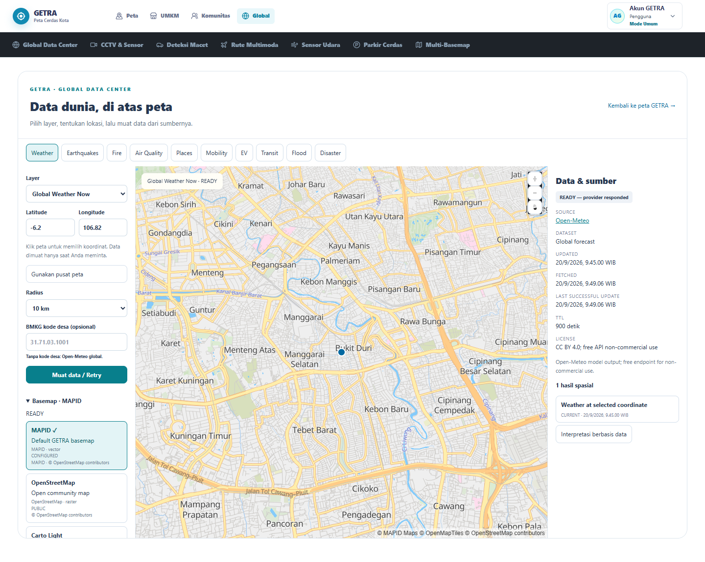

## Panduan per fitur

### Global Weather Now

[https://getra-routing-api.tail0ed517.ts.net:8443/international/weather](https://getra-routing-api.tail0ed517.ts.net:8443/international/weather)

Melihat cuaca model dan prakiraan pada lokasi yang dipilih.

Sumber: **Open-Meteo / BMKG**. Snapshot: **LIVE**, 1 record.

1. Pilih koordinat melalui klik peta atau isi Latitude dan Longitude.
2. Untuk Indonesia, isi kode desa BMKG (adm4) bila tersedia; tanpa kode desa digunakan Open-Meteo.
3. Tekan Muat data / Retry. Klik titik atau nama hasil untuk membuka suhu, kelembapan, angin, hujan, visibilitas dan forecast.
4. Periksa Updated, TTL, sumber dan status sebelum memakai hasil.

**Batasan:** BMKG adalah prakiraan; Open-Meteo adalah keluaran model, bukan sensor lapangan. TTL Open-Meteo 15 menit, BMKG 6 jam.

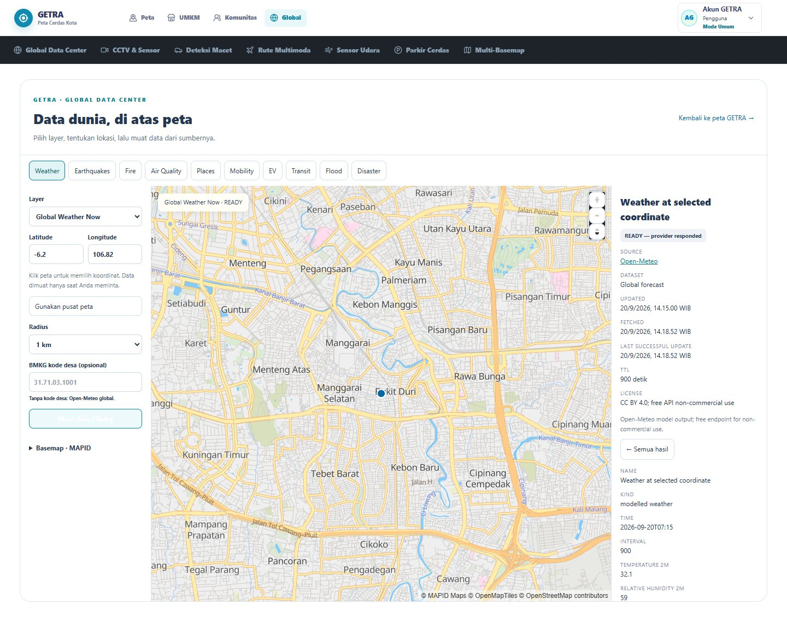

### Global Earthquake Live

[https://getra-routing-api.tail0ed517.ts.net:8443/international/earthquakes](https://getra-routing-api.tail0ed517.ts.net:8443/international/earthquakes)

Menelusuri gempa dalam feed satu hari terakhir berdasarkan jarak dan magnitudo.

Sumber: **USGS**. Snapshot: **LIVE**, 83 record.

1. Pilih pusat pencarian dan radius. Pilihan Global (gempa) menampilkan jangkauan dunia.
2. Pilih magnitudo minimum M2+, M4+, M5+ atau M6+; waktu dapat dibatasi.
3. Tekan Muat data / Retry dan perbesar cluster untuk melihat kejadian.
4. Buka detail untuk magnitudo, kedalaman, waktu kejadian dan pembaruan provider.

**Batasan:** Feed bukan prediksi gempa. Tsunami flag/alert hanya ditampilkan jika disediakan USGS. TTL 60 detik.

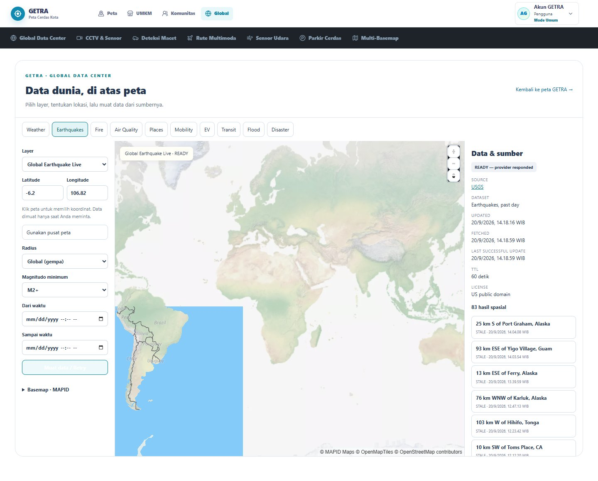

### Active Fire / Hotspot

[https://getra-routing-api.tail0ed517.ts.net:8443/international/active-fire](https://getra-routing-api.tail0ed517.ts.net:8443/international/active-fire)

Memetakan deteksi titik panas satelit yang diterbitkan FIRMS.

Sumber: **NASA FIRMS · VIIRS SNPP**. Snapshot: **AUTH_REQUIRED**, 0 record.

1. Operator memasang NASA_FIRMS_MAP_KEY pada backend.
2. Pilih koordinat dan radius, lalu tekan Muat data / Retry.
3. Jika sumber terhubung, klik hotspot untuk confidence, acquisition time, satellite dan FRP bila tersedia.
4. Jika AUTH_REQUIRED muncul, minta operator mengaktifkan sumber; jangan menafsirkan peta kosong sebagai tidak ada kebakaran.

**Batasan:** Pada audit ini key belum tersedia. Deteksi satelit bukan konfirmasi kebakaran di permukaan. TTL 15 menit.

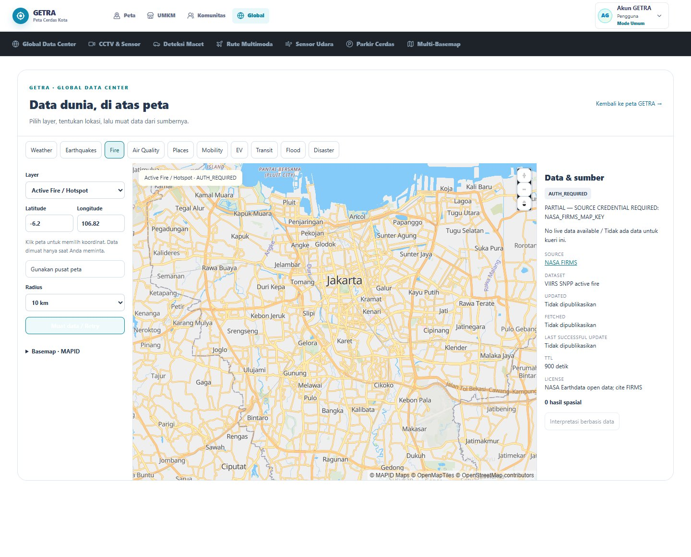

### Global Air Quality

[https://getra-routing-api.tail0ed517.ts.net:8443/international/air-quality](https://getra-routing-api.tail0ed517.ts.net:8443/international/air-quality)

Membaca pengamatan kualitas udara dari stasiun dan sensor yang dipublikasikan.

Sumber: **OpenAQ API v3**. Snapshot: **AUTH_REQUIRED**, 0 record.

1. Operator memasang OPENAQ_API_KEY pada backend.
2. Pilih koordinat dan radius, kemudian muat data.
3. Buka detail sensor untuk parameter, nilai, satuan, provider dan waktu pengamatan.
4. Bandingkan hasil hanya setelah memeriksa satuan serta freshness setiap sensor.

**Batasan:** Key belum tersedia pada audit ini. Parameter yang tidak dilaporkan tidak diisi angka nol. Maksimum 10 lokasi per kueri; TTL 1 jam.

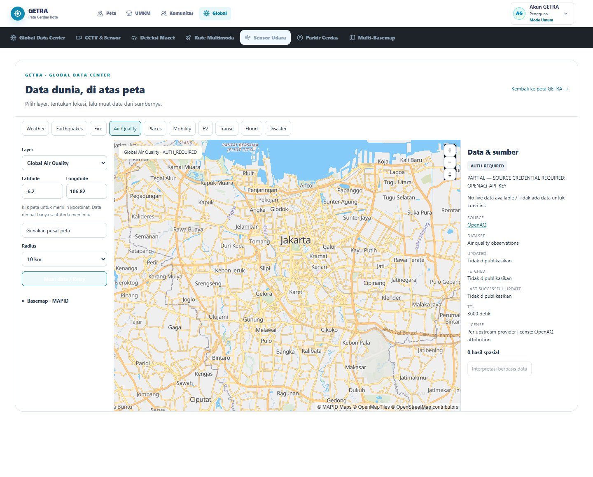

### Global Place / Geocoding

[https://getra-routing-api.tail0ed517.ts.net:8443/international/places](https://getra-routing-api.tail0ed517.ts.net:8443/international/places)

Mencari nama tempat dan koordinat untuk konteks peta serta tujuan rute.

Sumber: **GeoNames**. Snapshot: **AUTH_REQUIRED**, 0 record.

1. Operator mengaktifkan akun web services GeoNames melalui GEONAMES_USERNAME.
2. Isi Cari tempat / sistem dengan nama kota atau tempat, atau kosongkan untuk pencarian dekat koordinat.
3. Muat hasil dan pilih tempat untuk melihat negara, wilayah administratif, timezone/elevasi bila tersedia.
4. Gunakan Rute ke lokasi ini untuk mengirim koordinat ke perencana rute GETRA.

**Batasan:** Akun GeoNames belum tersedia. AI tidak menebak koordinat nama tempat jika resolusi sumber gagal. TTL 24 jam.

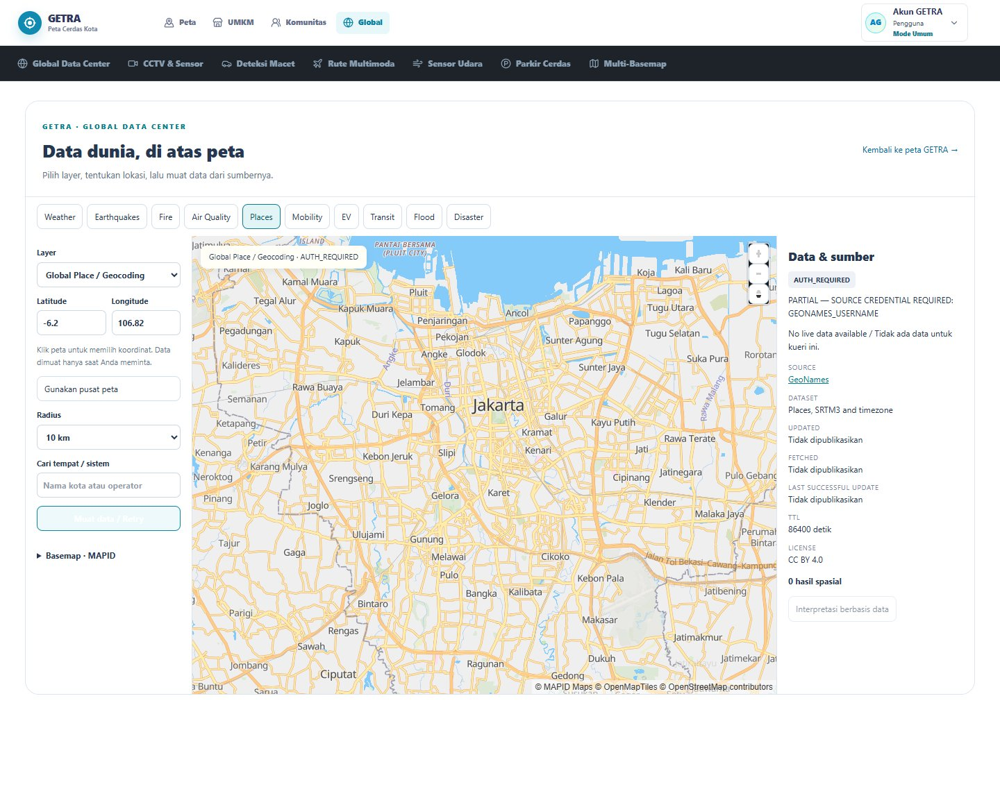

### Global Elevation Query

[https://getra-routing-api.tail0ed517.ts.net:8443/international/elevation](https://getra-routing-api.tail0ed517.ts.net:8443/international/elevation)

Membaca elevasi terrain pada titik dan sampel rute.

Sumber: **GeoNames · SRTM3**. Snapshot: **AUTH_REQUIRED**, 0 record.

1. Pilih koordinat pada peta dan muat data setelah akun GeoNames aktif.
2. Untuk profil, isi pasangan [longitude,latitude] dalam array JSON, maksimal 20 titik.
3. Ambil rute aktif hanya bekerja jika geometri rute masih dapat dibaca dalam konteks halaman.
4. Buka detail sampel untuk elevasi dan jarak geodesik kumulatif.

**Batasan:** Key/account belum tersedia. Resolusi SRTM3 sekitar 90 m; nilai no-data tetap null. Bukan profil kemiringan rinci atau analisis keselamatan.

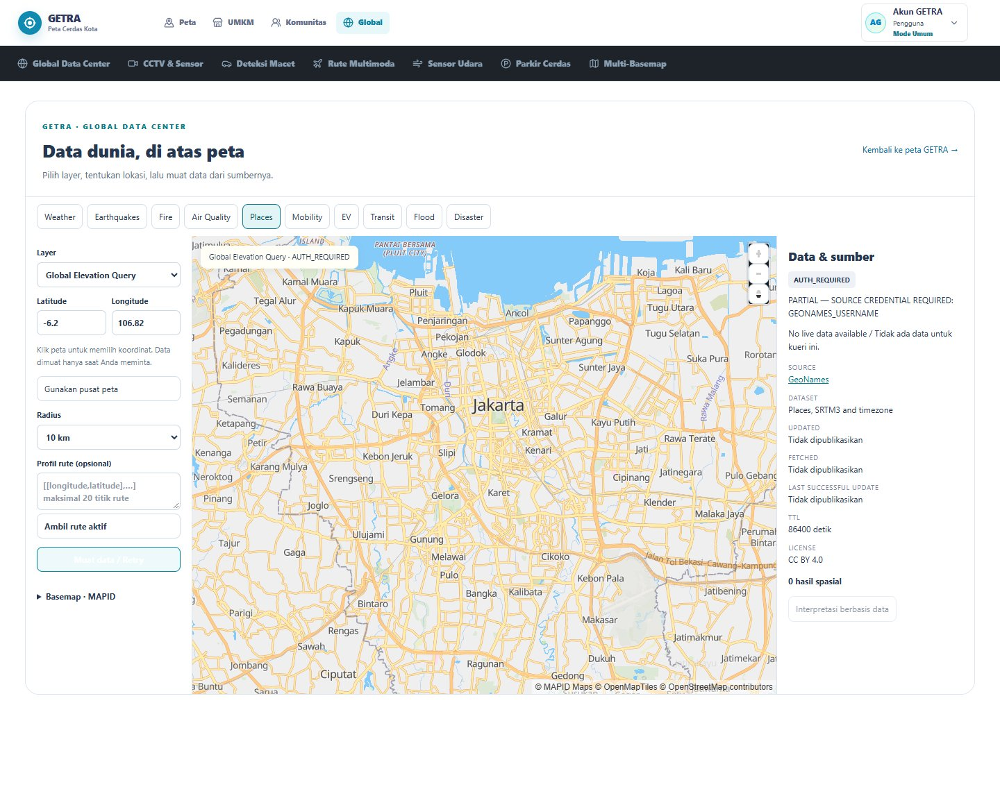

### Global Timezone / Sun

[https://getra-routing-api.tail0ed517.ts.net:8443/international/timezone](https://getra-routing-api.tail0ed517.ts.net:8443/international/timezone)

Membaca zona waktu, waktu lokal, matahari terbit dan terbenam dari koordinat.

Sumber: **GeoNames**. Snapshot: **AUTH_REQUIRED**, 0 record.

1. Pastikan GEONAMES_USERNAME telah diaktifkan operator.
2. Pilih koordinat tujuan dan tekan Muat data / Retry.
3. Buka hasil untuk timezone, local time, sunrise, sunset dan offset yang dipublikasikan.
4. Periksa waktu fetch; tampilan waktu lokal adalah respons sumber, bukan jam yang terus berdetak.

**Batasan:** Akun belum tersedia. String waktu lokal tidak dianggap UTC secara otomatis. TTL respons sukses 1 jam.

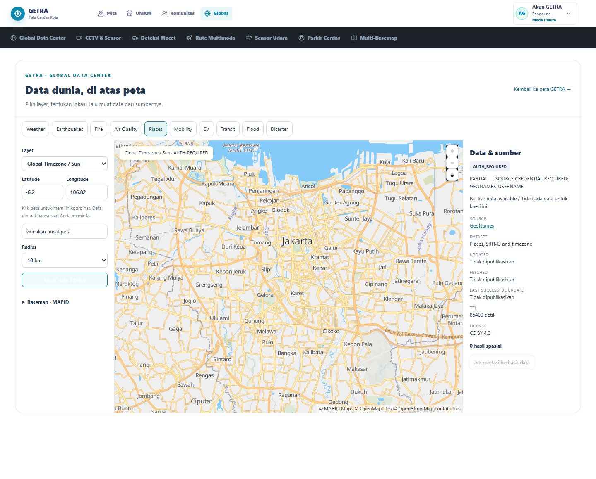

### OpenStreetMap POI Explorer

[https://getra-routing-api.tail0ed517.ts.net:8443/international/poi](https://getra-routing-api.tail0ed517.ts.net:8443/international/poi)

Mencari fasilitas nyata berdasarkan tag OSM.

Sumber: **OpenStreetMap / Overpass**. Snapshot: **LIVE**, 70 record.

1. Pilih pusat pencarian dan radius; kueri Overpass dibatasi sampai 10 km.
2. Pilih Fasilitas, misalnya restaurant, pharmacy, hospital atau library.
3. Tekan Muat data / Retry; permintaan tidak berjalan otomatis pada setiap gerakan peta.
4. Klik titik/hasil untuk tag, waktu edit, sumber objek OSM dan tautan rute.

**Batasan:** Data tergantung kelengkapan kontribusi OSM. Timeout provider dapat terjadi; maksimal 1000 objek. TTL 1 jam.

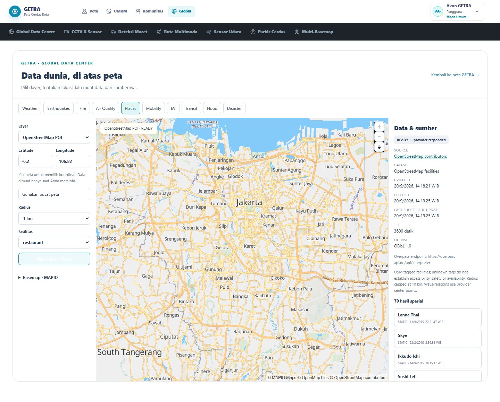

### Accessible Facility Finder

[https://getra-routing-api.tail0ed517.ts.net:8443/international/accessibility](https://getra-routing-api.tail0ed517.ts.net:8443/international/accessibility)

Menemukan fasilitas dengan tag wheelchair yang eksplisit.

Sumber: **Tag aksesibilitas OpenStreetMap**. Snapshot: **LIVE**, 0 record.

1. Pilih toilet, entrance, parking, hospital atau station pada Fasilitas.
2. Atur koordinat/radius dan muat data.
3. Baca wheelchair=yes, limited atau no pada detail; jangan menganggap semua hasil aksesibel penuh.
4. Jika hasil kosong, itu berarti tidak ada objek bertag yang cocok dalam hasil kueri, bukan bukti tidak adanya fasilitas.

**Batasan:** GETRA tidak menginfer aksesibilitas tanpa tag. Kondisi lapangan dan pembaruan OSM dapat berbeda. TTL 1 jam.

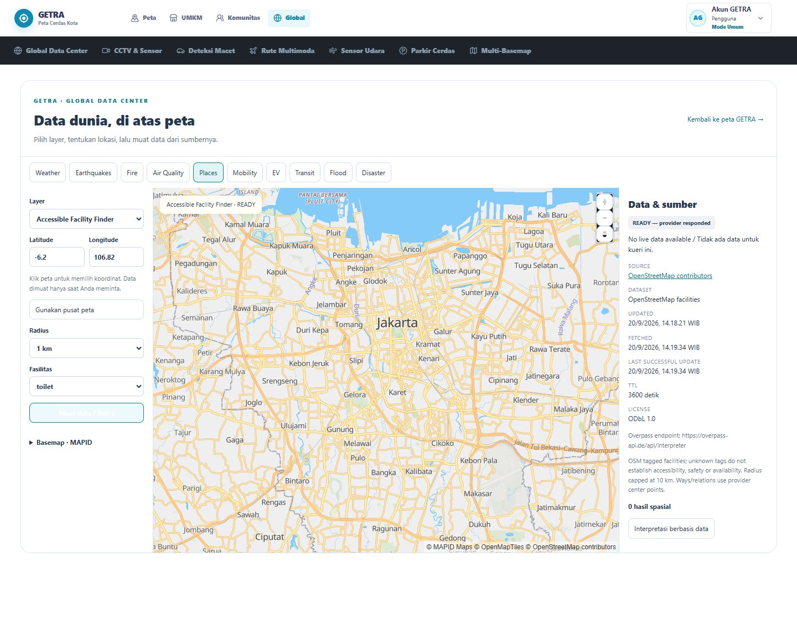

### Drinking Water Map

[https://getra-routing-api.tail0ed517.ts.net:8443/international/water-refill](https://getra-routing-api.tail0ed517.ts.net:8443/international/water-refill)

Menemukan lokasi air minum yang tercatat di OSM.

Sumber: **OSM amenity=drinking_water**. Snapshot: **LIVE**, 2 record.

1. Pilih lokasi dan radius, lalu muat data.
2. Buka titik untuk access, bottle refill, indoor dan opening hours jika tag tersedia.
3. Periksa sumber dan waktu edit sebelum menuju lokasi.
4. Gunakan Rute ke lokasi ini untuk melanjutkan ke perencana perjalanan.

**Batasan:** Keberadaan tag bukan jaminan keamanan air atau operasional saat ini. Overpass dapat timeout; TTL 1 jam.

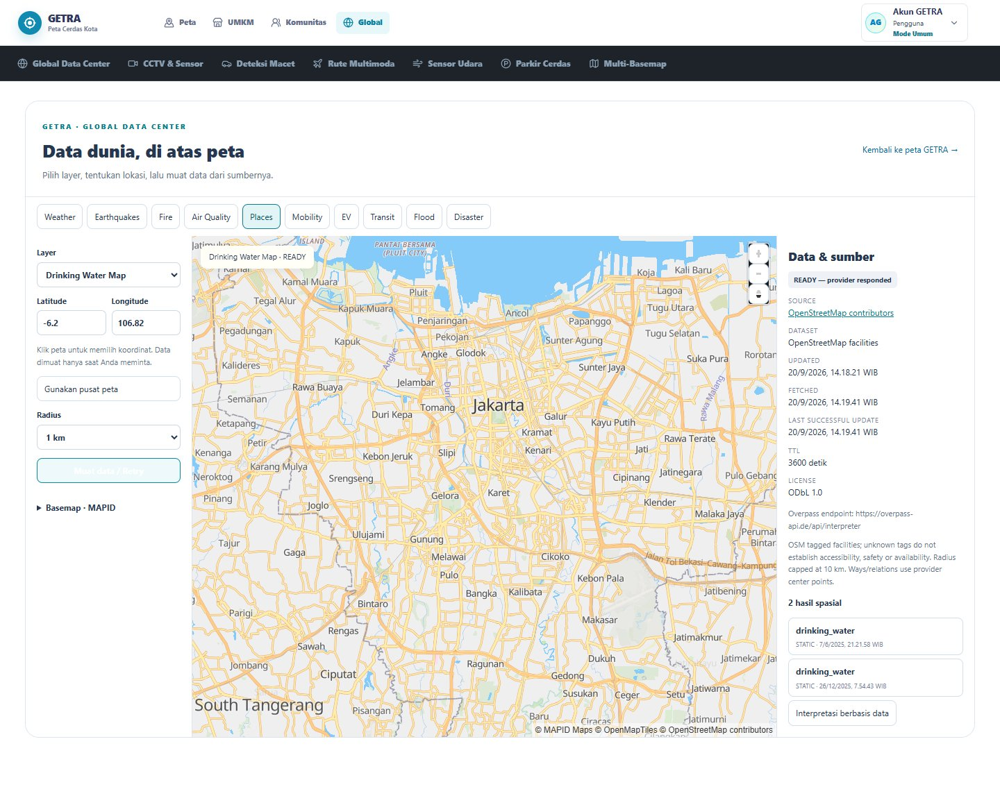

### Global Bike Share

[https://getra-routing-api.tail0ed517.ts.net:8443/international/bikeshare](https://getra-routing-api.tail0ed517.ts.net:8443/international/bikeshare)

Menampilkan stasiun sepeda dan status yang dipublikasikan operator.

Sumber: **MobilityData catalog / GBFS operator**. Snapshot: **LIVE**, 2520 record.

1. Cari kota/operator, lalu tekan Muat data untuk mengambil katalog GBFS.
2. Pilih Sistem GBFS dan tekan Muat data lagi; contoh yang diuji: Citi Bike NYC (lyft_nyc).
3. Klik stasiun untuk available bikes, available docks, is_renting/is_returning dan last_reported.
4. Perhatikan status STALE, nilai yang tidak dipublikasikan dan TTL operator.

**Batasan:** Pemilihan sistem memuat feed operator hingga 3000 record; radius belum memfilter seluruh feed. Pricing/geofencing belum tersedia. Katalog bukan jaminan feed aktif.

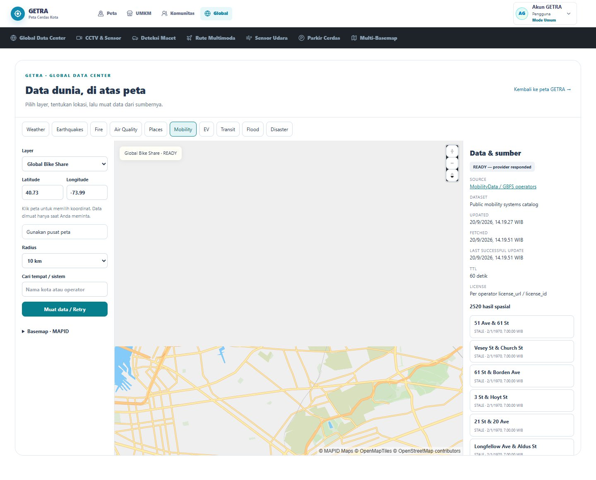

### Shared Micromobility

[https://getra-routing-api.tail0ed517.ts.net:8443/international/micromobility](https://getra-routing-api.tail0ed517.ts.net:8443/international/micromobility)

Memetakan skuter, moped atau cargo bike yang dipublikasikan operator.

Sumber: **GBFS vehicle types / vehicle status**. Snapshot: **LIVE**, 3000 record.

1. Muat katalog, cari operator dan pilih Sistem GBFS.
2. Muat kembali untuk mengambil kendaraan; contoh uji: Dott Berlin.
3. Klik kendaraan untuk tipe, reservation/disabled status, station ID dan baterai/range bila tersedia.
4. Jika Truncated muncul, jumlah yang tampil merupakan batas hasil, bukan ukuran total armada.

**Batasan:** Maksimum 3000 record; nilai baterai yang hilang tetap unknown. Tidak semua bentuk feed operator didukung; zona geofencing belum ditampilkan.

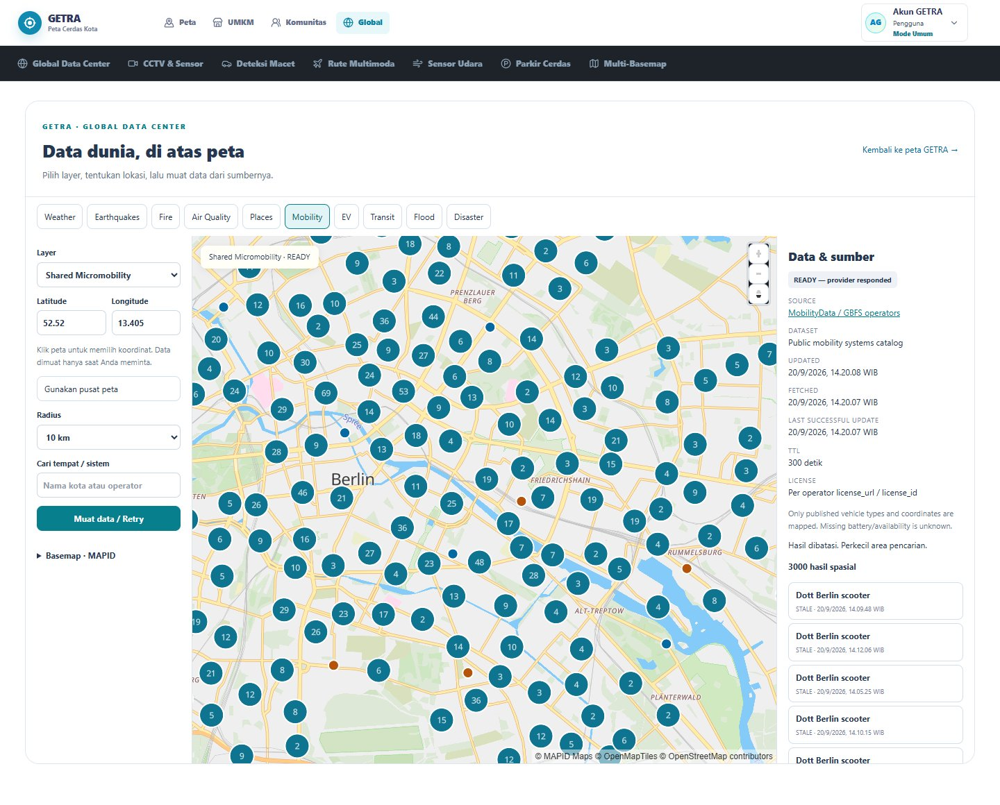

### EV Charging Map

[https://getra-routing-api.tail0ed517.ts.net:8443/international/ev-charging](https://getra-routing-api.tail0ed517.ts.net:8443/international/ev-charging)

Menemukan lokasi pengisian kendaraan listrik yang tercatat.

Sumber: **OSM charging_station**. Snapshot: **LIVE**, 10 record.

1. Pilih pusat pencarian dan radius, lalu muat data.
2. Buka detail untuk connector/socket tags, capacity, operator, access dan jam operasional bila tersedia.
3. Gunakan tautan rute untuk menuju koordinat lokasi.
4. Baca LOCATION KNOWN sebagai lokasi tercatat, bukan charger kosong atau tersedia sekarang.

**Batasan:** Tidak ada sumber ketersediaan charger real-time yang terhubung. Kondisi terbaru harus dikonfirmasi ke operator. TTL 1 jam.

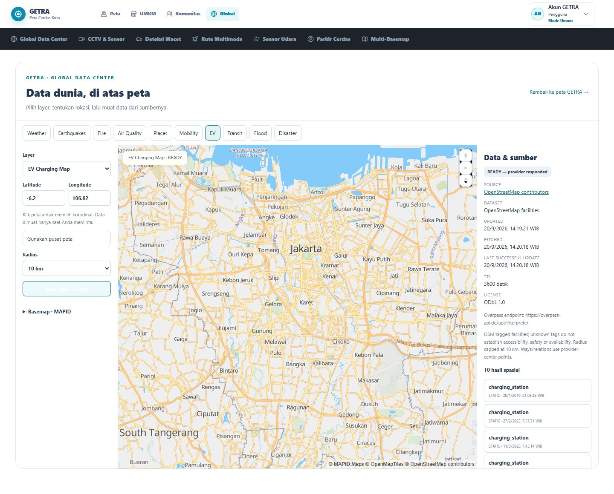

### Global Public Transit POI

[https://getra-routing-api.tail0ed517.ts.net:8443/international/transit-stops](https://getra-routing-api.tail0ed517.ts.net:8443/international/transit-stops)

Menampilkan titik bus, rail/tram, ferry dan airport dari OSM.

Sumber: **OpenStreetMap**. Snapshot: **LIVE**, 50 record.

1. Pilih lokasi dan radius, lalu muat data transit.
2. Perbesar cluster dan klik titik untuk nama, tipe dan tag provider.
3. Gunakan Rute ke lokasi ini; perencana GETRA menerima koordinat tujuan.
4. Tentukan titik asal dan moda pada peta utama sebelum memulai perjalanan.

**Batasan:** Layer ini berisi inventaris lokasi, bukan jadwal keberangkatan atau posisi kendaraan langsung. TTL 1 jam.

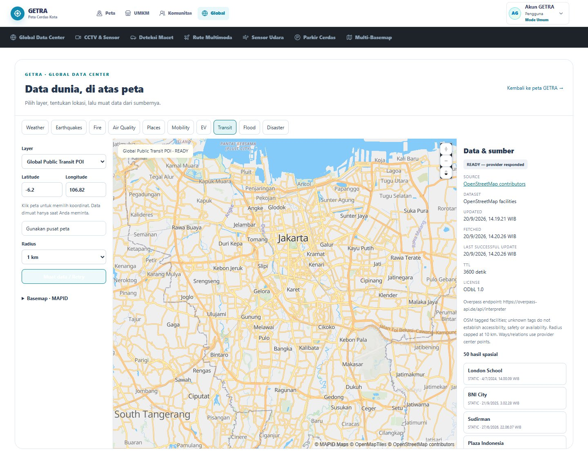

### DKI Public Transport

[https://getra-routing-api.tail0ed517.ts.net:8443/international/jakarta-transit](https://getra-routing-api.tail0ed517.ts.net:8443/international/jakarta-transit)

Menggunakan inventaris halte dari sumber resmi DKI.

Sumber: **Jakarta Satu / ArcGIS Transjakarta**. Snapshot: **LIVE**, 4 record.

1. Pilih koordinat di DKI Jakarta dan radius pencarian.
2. Tekan Muat data / Retry untuk menjalankan spatial query ArcGIS.
3. Klik halte untuk atribut, koordinat, tipe dan sumber resminya.
4. Gunakan route handoff jika ingin menyusun perjalanan menuju halte.

**Batasan:** Integrasi saat ini khusus Halte Transjakarta. Layer KRL/bandara dan posisi kendaraan live belum digabung. Update inventory tidak dipublikasikan; cache 24 jam.

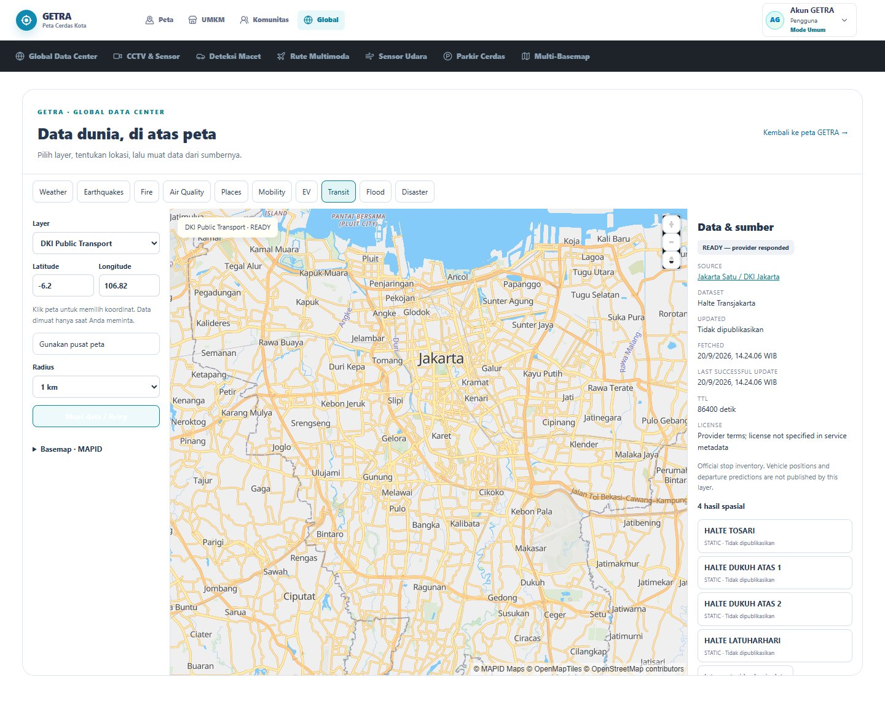

### DKI Flood & Water Level

[https://getra-routing-api.tail0ed517.ts.net:8443/international/flood](https://getra-routing-api.tail0ed517.ts.net:8443/international/flood)

Menyiapkan konsumsi pengamatan banjir/tinggi muka air resmi dengan status asli provider.

Sumber: **Kontrak feed resmi DKI / DSDA**. Snapshot: **UNAVAILABLE**, 0 record.

1. Operator harus menyediakan feed resmi terverifikasi melalui DKI_FLOOD_GEOJSON_URL.
2. Pilih lokasi/radius dan muat data setelah sumber terhubung.
3. Jika ada pengamatan, baca timestamp, official_status dan thresholds dari provider.
4. Jika UNAVAILABLE tampil, tidak ada kesimpulan kondisi banjir yang dapat dibuat.

**Batasan:** DATA SOURCE NOT CONNECTED pada audit ini. Tidak ada NORMAL/WASPADA/SIAGA/BAHAYA hasil rekaan. Belum memenuhi acceptance data live.

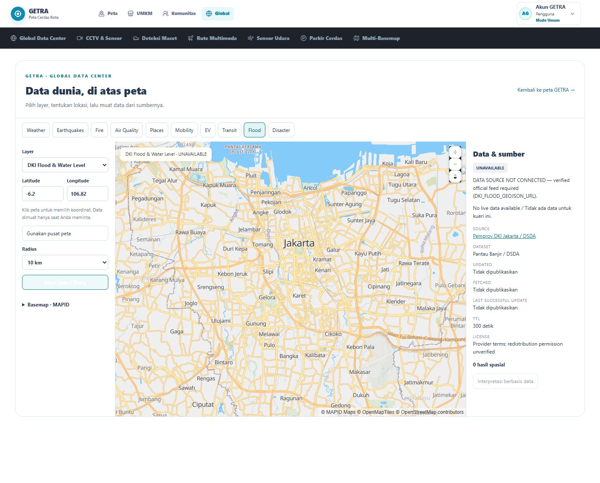

### DKI Disaster Map

[https://getra-routing-api.tail0ed517.ts.net:8443/international/disaster](https://getra-routing-api.tail0ed517.ts.net:8443/international/disaster)

Menyiapkan tampilan insiden berdasarkan jenis, tahun dan waktu dari dataset resmi.

Sumber: **Kontrak data resmi BPBD DKI**. Snapshot: **UNAVAILABLE**, 0 record.

1. Operator menghubungkan dataset BPBD resmi melalui DKI_DISASTER_GEOJSON_URL.
2. Pilih tahun, jenis insiden dan rentang waktu yang diperlukan.
3. Muat data dan buka record untuk waktu, lokasi, district serta atribut sumber yang tersedia.
4. UNAVAILABLE menunjukkan feed belum terhubung; peta kosong bukan bukti nihil bencana.

**Batasan:** Dataset aktual belum terhubung. Kontrak saat ini menerima point incidents WGS84; bukan dashboard tanggap darurat live.

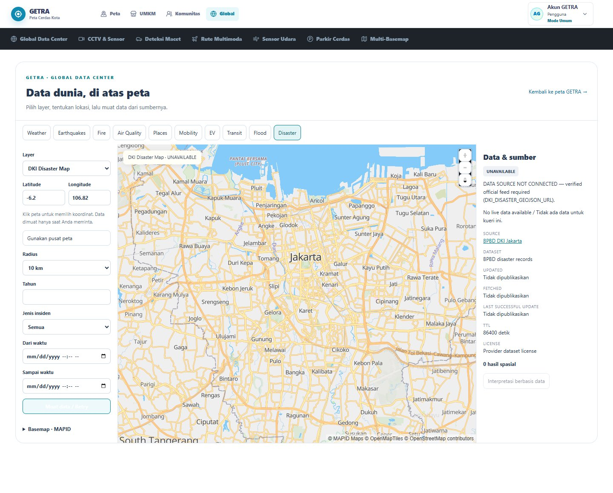

### BMKG Weather Radar

[https://getra-routing-api.tail0ed517.ts.net:8443/international/weather-radar](https://getra-routing-api.tail0ed517.ts.net:8443/international/weather-radar)

Menampilkan overlay radar yang mempunyai georeference dan metadata resmi.

Sumber: **BMKG official ArcGIS radar mosaic**. Snapshot: **ERROR**, 0 record.

1. Buka layer radar dan tekan Muat data / Retry.
2. Jika provider tersedia dan metadata valid, overlay serta legend akan muncul.
3. Atur Opasitas untuk membandingkan radar dengan basemap.
4. Periksa waktu citra; saat ERROR/timeout, ulangi nanti dan jangan menganggap tidak ada hujan.

**Batasan:** Endpoint resmi mengembalikan HTTP 522/timeout pada audit sebelumnya. Belum ada radar live/animasi yang diterima lulus; bounds tidak ditebak.

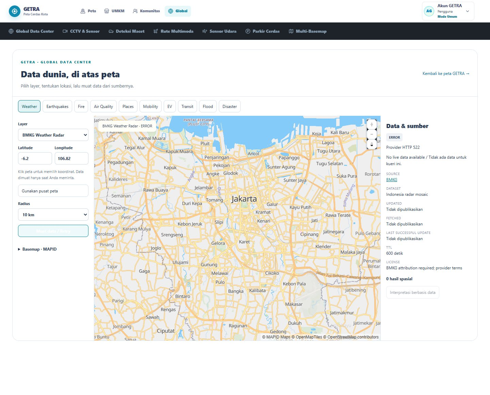

### BMKG Satellite Weather

[https://getra-routing-api.tail0ed517.ts.net:8443/international/weather-satellite](https://getra-routing-api.tail0ed517.ts.net:8443/international/weather-satellite)

Menyiapkan tampilan citra awan dengan batas spasial, waktu dan legend yang dapat diverifikasi.

Sumber: **Kontrak manifest resmi BMKG**. Snapshot: **UNAVAILABLE**, 0 record.

1. Operator menyediakan BMKG_SATELLITE_MANIFEST_URL pada domain resmi.
2. Manifest harus memuat URL citra, empat koordinat batas, timestamp dan legend.
3. Muat layer; jika valid, baca waktu citra dan atur opacity.
4. UNAVAILABLE berarti sumber belum tersambung, bukan langit cerah.

**Batasan:** Manifest resmi terverifikasi belum tersedia. Gambar publik tanpa bounds/time tidak ditempel sebagai overlay dengan georeference buatan.

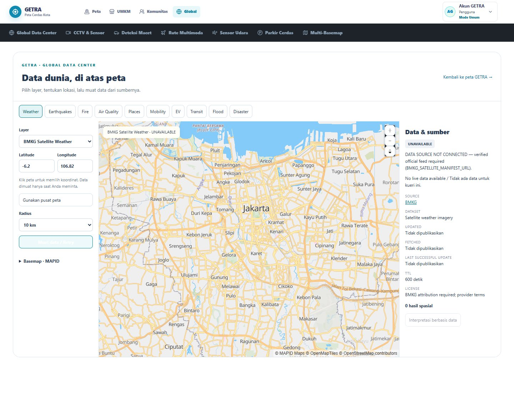

### Global Open Data Explorer

[https://getra-routing-api.tail0ed517.ts.net:8443/international/open-data](https://getra-routing-api.tail0ed517.ts.net:8443/international/open-data)

Mengakses dataset yang telah diintegrasikan melalui satu panel.

Sumber: **Adapter sumber yang dipilih**. Snapshot: **LIVE**, 84 record.

1. Pada Dataset, pilih sumber fungsional, misalnya Earthquake, POI atau Weather.
2. Atur lokasi, radius, kategori/magnitudo/kode desa sesuai dataset; rentang waktu bersifat opsional.
3. Tekan Muat data. Sumber, lisensi, freshness dan timestamp mengikuti adapter yang dipilih.
4. Gunakan Interpretasi berbasis data untuk ringkasan hasil dari tool provider.

**Batasan:** Bukan katalog lengkap semua open data global. Status AUTH_REQUIRED/UNAVAILABLE tetap berlaku sesuai dataset. Filter waktu mengecualikan record tanpa timestamp.

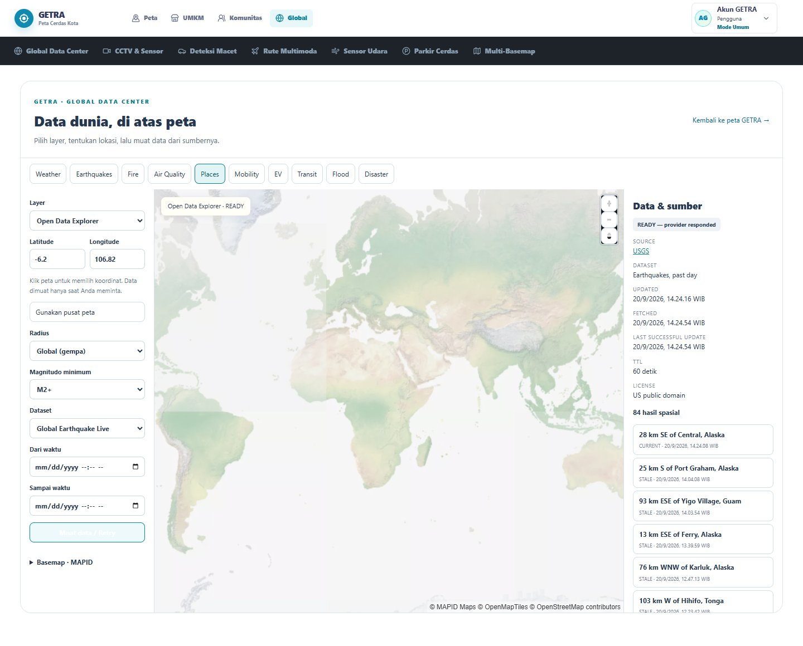

## Batasan penerimaan

Lima fitur masih membutuhkan kredensial; flood/disaster/satellite belum terhubung; radar dan Overpass dapat gagal. Service area belum memenuhi acceptance geometri live. Pricing/geofencing GBFS dan beberapa integrasi lanjutan belum selesai. Dokumentasi tidak mengklaim semua fitur complete.

## Reproduksi dokumentasi

```powershell
node scripts/capture-international-guide.mjs
node scripts/generate-international-guide.mjs
```

Folder default PDF: `D:\getra docs\Production docs\final\LAST FEATURE\50 feature\astra`. Source, PDF, screenshot dan capture-report.json juga disimpan pada direktori ini di GitHub.
